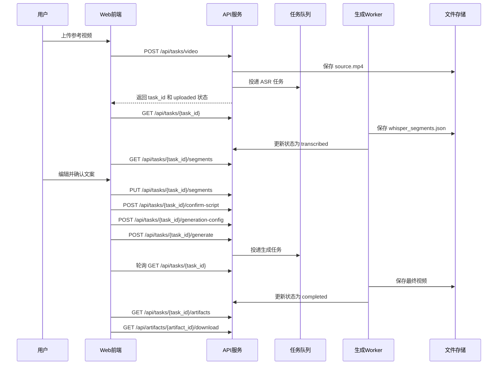
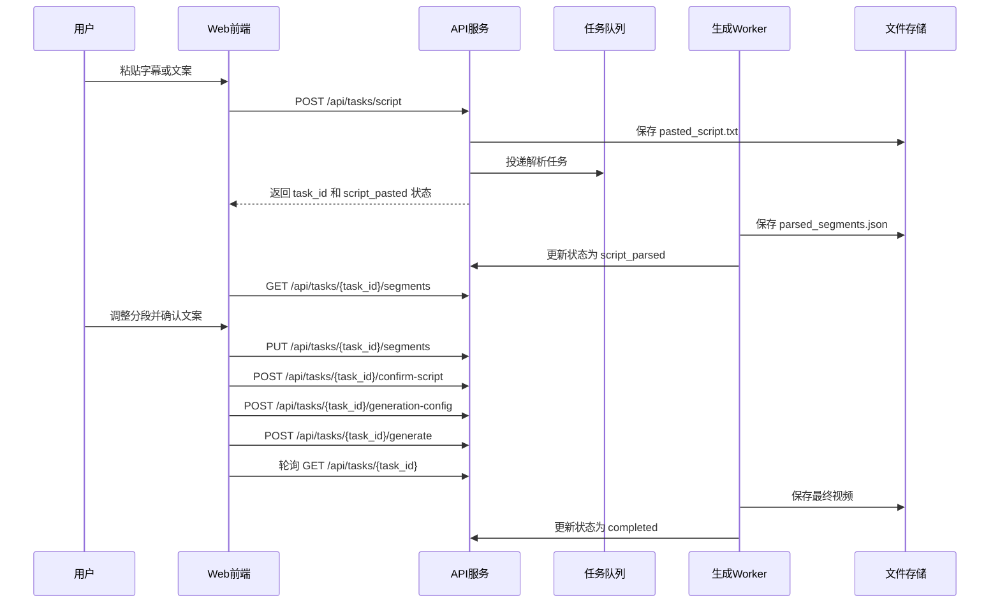

# 数字人视频生成项目前后端 API 接口文档

## 1. 文档说明

本文档从 `docs/technical-architecture.md` 中抽离 API 相关内容，作为前端页面、后端 FastAPI 路由和联调测试的接口依据。

API 服务只负责参数校验、任务状态管理、文件路径记录和异步任务投递，不直接执行 Whisper、CozyVoice、HeyGem、FFmpeg 等长耗时任务。生成进度通过任务状态查询接口返回给前端。

## 2. 前后端调用总览

### 2.1 上传视频自动识别流程



### 2.2 粘贴字幕 / 文案流程



## 3. 通用约定

### 3.1 Base URL

MVP 本地开发：

```text
http://localhost:8000
```

接口统一以 `/api` 开头。

### 3.2 请求格式

- 普通 JSON 接口使用 `Content-Type: application/json`。
- 上传视频接口使用 `multipart/form-data`。
- 下载接口由后端返回文件流或短期有效下载链接。

### 3.3 通用响应格式

成功响应：

```json
{
  "success": true,
  "data": {}
}
```

失败响应：

```json
{
  "success": false,
  "error": {
    "code": "VALIDATION_ERROR",
    "message": "上传文件格式不支持",
    "detail": {}
  }
}
```

实现注意：

- `message` 面向用户展示，必须是简短中文说明。
- `detail` 只放非敏感排查信息，不返回内部命令、token、完整系统路径。
- 前端判断业务失败优先读取 `error.code`，展示文案读取 `error.message`。

### 3.4 通用状态码

| HTTP 状态码 | 使用场景 |
| --- | --- |
| `200` | 查询或更新成功。 |
| `201` | 创建任务成功。 |
| `202` | 已接受异步处理请求。 |
| `400` | 参数格式错误、状态不允许、文件不合法。 |
| `403` | 当前用户无权访问任务或产物，账号系统接入后启用。 |
| `404` | 任务、段落、产物不存在。 |
| `409` | 当前任务状态不允许执行该操作。 |
| `413` | 上传文件或文本过大。 |
| `500` | 服务端未预期错误。 |

### 3.5 鉴权预留

MVP 可以先不启用账号系统。后续接入多用户时建议：

- 使用 `Authorization: Bearer <token>`。
- 所有 `task_id`、`artifact_id` 查询必须校验归属用户。
- 下载链接使用短期签名，避免长期暴露文件路径。

## 4. 数据结构

### 4.1 Task

```json
{
  "id": "task_01HZX...",
  "script_source": "video_asr",
  "status": "transcribed",
  "source_video_path": "storage/tasks/task_01HZX/input/source.mp4",
  "duration": 62.5,
  "aspect_ratio": "9:16",
  "voice_profile_id": "voice_default",
  "avatar_profile_id": "avatar_default",
  "error_code": null,
  "error_message": null,
  "created_at": "2026-06-01T06:30:00Z",
  "updated_at": "2026-06-01T06:35:00Z"
}
```

### 4.2 ScriptSegment

```json
{
  "id": "seg_001",
  "task_id": "task_01HZX...",
  "index": 1,
  "source_type": "whisper",
  "start_time": 0.0,
  "end_time": 4.2,
  "original_text": "大家好，今天介绍一个数字人口播流程。",
  "edited_text": "大家好，今天介绍一个数字人口播视频生成流程。",
  "confidence": 0.94
}
```

### 4.3 Artifact

```json
{
  "id": "artifact_final_video",
  "task_id": "task_01HZX...",
  "type": "final_video",
  "path": "storage/tasks/task_01HZX/output/final_with_subtitle.mp4",
  "meta": {
    "duration": 62.5,
    "format": "mp4",
    "size_bytes": 10485760
  },
  "created_at": "2026-06-01T06:50:00Z"
}
```

### 4.4 VoiceProfile

```json
{
  "id": "voice_default",
  "name": "默认中文女声",
  "provider": "cozyvoice",
  "sample_path": "storage/voices/default.wav",
  "config": {
    "speed": 1.0,
    "volume": 1.0
  }
}
```

### 4.5 AvatarProfile

```json
{
  "id": "avatar_default",
  "name": "默认数字人",
  "provider": "heygem",
  "config": {
    "resolution": "1080x1920",
    "template_path": "storage/avatars/default"
  }
}
```

### 4.6 RiskCheck

```json
{
  "id": "risk_01HZX...",
  "task_id": "task_01HZX...",
  "stage": "script",
  "risk_status": "warning",
  "risk_level": "medium",
  "risk_types": ["sensitive_keyword", "privacy"],
  "findings": [
    {
      "id": "finding_01HZX...",
      "type": "sensitive_keyword",
      "target": "script",
      "text": "命中的关键词或说明",
      "position": "第 3 段 / 00:12",
      "suggestion": "建议替换或删除该表述"
    }
  ],
  "reviewed_by": "system",
  "reviewed_at": null,
  "created_at": "2026-06-01T06:40:00Z"
}
```

### 4.7 AuthorizationRecord

```json
{
  "id": "auth_01HZX...",
  "task_id": "task_01HZX...",
  "asset_type": "voice",
  "source": "user_upload",
  "authorization_confirmed": true,
  "authorization_note": "用户确认拥有声音素材授权",
  "confirmed_at": "2026-06-01T06:31:00Z"
}
```

## 5. 后端路由建议

FastAPI 路由建议按资源和页面流程拆分，避免所有接口堆在一个文件里。

| Router 文件 | 接口范围 | 主要依赖 Service |
| --- | --- | --- |
| `app/api/routers/tasks.py` | 创建任务、查询任务、启动生成、失败重试。 | `task_service.py`、`generation_service.py` |
| `app/api/routers/segments.py` | 获取、保存、确认文案段落。 | `script_service.py` |
| `app/api/routers/profiles.py` | 获取音色列表、数字人列表。 | `task_service.py` 或独立 `profile_service.py` |
| `app/api/routers/artifacts.py` | 查询产物列表、下载产物。 | `artifact_service.py` |
| `app/api/routers/risk_checks.py` | 查询风险结果、人工确认风险、发布前合规检查。 | `risk_service.py` |

调用边界：

- Router 只负责 HTTP 入参、权限校验和响应封装，不直接操作数据库模型。
- Service 负责业务编排，例如创建任务、保存文案、投递 Celery 任务。
- Repository 负责 SQLAlchemy 查询，避免业务代码散落 SQL 细节。
- Worker 执行长耗时任务后，通过 Repository 更新任务状态和产物记录。

## 6. 接口详情

### 6.1 上传视频并创建任务

```http
POST /api/tasks/video
```

用途：上传参考视频，创建 ASR 任务，后端保存原始视频并投递音频提取和 Whisper 识别任务。

前端调用时机：任务创建页中，用户选择“上传视频”并提交后调用。

请求格式：`multipart/form-data`

| 参数 | 类型 | 必填 | 说明 |
| --- | --- | --- | --- |
| `file` | file | 是 | 参考视频文件，建议限制为 `mp4` / `mov`。 |
| `aspect_ratio` | string | 否 | 期望输出比例，例如 `9:16`。 |
| `authorization_confirmed` | boolean | 是 | 用户确认拥有素材授权。 |

响应示例：

```json
{
  "success": true,
  "data": {
    "task": {
      "id": "task_01HZX...",
      "script_source": "video_asr",
      "status": "uploaded",
      "created_at": "2026-06-01T06:30:00Z",
      "updated_at": "2026-06-01T06:30:00Z"
    }
  }
}
```

常见错误：

- `VALIDATION_ERROR`：文件类型、大小、时长或授权确认不符合要求。

### 6.2 粘贴字幕 / 文案并创建任务

```http
POST /api/tasks/script
```

用途：创建粘贴文案任务，后端保存原始文本并解析为统一的文案段落。

前端调用时机：任务创建页中，用户选择“粘贴字幕 / 文案”并提交后调用。

请求示例：

```json
{
  "content": "大家好，今天介绍一个数字人口播流程。",
  "content_type": "pasted_script",
  "aspect_ratio": "9:16",
  "authorization_confirmed": true
}
```

| 参数 | 类型 | 必填 | 说明 |
| --- | --- | --- | --- |
| `content` | string | 是 | 用户粘贴的字幕或纯文案。 |
| `content_type` | enum | 是 | `pasted_subtitle` / `pasted_script`。 |
| `aspect_ratio` | string | 否 | 期望输出比例。 |
| `authorization_confirmed` | boolean | 是 | 用户确认拥有素材授权。 |

响应示例：

```json
{
  "success": true,
  "data": {
    "task": {
      "id": "task_01HZT...",
      "script_source": "pasted_script",
      "status": "script_pasted",
      "created_at": "2026-06-01T06:30:00Z",
      "updated_at": "2026-06-01T06:30:00Z"
    }
  }
}
```

常见错误：

- `VALIDATION_ERROR`：文本为空、超过长度限制或 `content_type` 不合法。
- `SCRIPT_PARSE_FAILED`：字幕格式无法解析。

### 6.3 获取文案段落

```http
GET /api/tasks/{task_id}/segments
```

用途：获取 Whisper 识别或粘贴文案解析后的段落，供前端展示和编辑。

前端调用时机：任务进入 `transcribed` 或 `script_parsed` 后，文案确认页加载时调用。

响应示例：

```json
{
  "success": true,
  "data": {
    "segments": [
      {
        "id": "seg_001",
        "task_id": "task_01HZX...",
        "index": 1,
        "source_type": "whisper",
        "start_time": 0.0,
        "end_time": 4.2,
        "original_text": "大家好，今天介绍一个数字人口播流程。",
        "edited_text": null,
        "confidence": 0.94
      }
    ]
  }
}
```

常见错误：

- `404`：任务不存在。
- `409`：任务尚未完成识别或解析。

### 6.4 保存用户修改后的段落

```http
PUT /api/tasks/{task_id}/segments
```

用途：保存用户编辑后的文案、分段顺序和时间信息。

前端调用时机：文案确认页中，用户点击保存或自动保存时调用。

请求示例：

```json
{
  "segments": [
    {
      "id": "seg_001",
      "index": 1,
      "start_time": 0.0,
      "end_time": 4.5,
      "edited_text": "大家好，今天介绍一个数字人口播视频生成流程。"
    }
  ]
}
```

响应示例：

```json
{
  "success": true,
  "data": {
    "segments": [
      {
        "id": "seg_001",
        "index": 1,
        "edited_text": "大家好，今天介绍一个数字人口播视频生成流程。"
      }
    ]
  }
}
```

常见错误：

- `VALIDATION_ERROR`：段落为空、顺序重复、结束时间早于开始时间。
- `409`：任务已进入生成阶段，不允许继续修改文案。

### 6.5 确认最终文案

```http
POST /api/tasks/{task_id}/confirm-script
```

用途：将当前段落保存为生成快照，任务状态更新为 `script_confirmed`。

前端调用时机：用户确认文案无误并进入配置页前调用。

请求示例：

```json
{
  "confirmed": true
}
```

响应示例：

```json
{
  "success": true,
  "data": {
    "task": {
      "id": "task_01HZX...",
      "status": "script_confirmed",
      "updated_at": "2026-06-01T06:40:00Z"
    }
  }
}
```

常见错误：

- `409`：任务尚未完成识别 / 解析，或没有可确认的文案段落。

### 6.6 获取音色列表

```http
GET /api/voice-profiles
```

用途：获取可选音色列表。

前端调用时机：配音与数字人配置页加载时调用。

响应示例：

```json
{
  "success": true,
  "data": {
    "voice_profiles": [
      {
        "id": "voice_default",
        "name": "默认中文女声",
        "provider": "cozyvoice",
        "sample_path": "storage/voices/default.wav",
        "config": {
          "speed": 1.0,
          "volume": 1.0
        }
      }
    ]
  }
}
```

### 6.7 获取数字人列表

```http
GET /api/avatar-profiles
```

用途：获取可选数字人列表。

前端调用时机：配音与数字人配置页加载时调用。

响应示例：

```json
{
  "success": true,
  "data": {
    "avatar_profiles": [
      {
        "id": "avatar_default",
        "name": "默认数字人",
        "provider": "heygem",
        "config": {
          "resolution": "1080x1920",
          "template_path": "storage/avatars/default"
        }
      }
    ]
  }
}
```

### 6.8 保存生成配置

```http
POST /api/tasks/{task_id}/generation-config
```

用途：保存音色、数字人、输出比例和字幕样式配置。

前端调用时机：用户在配置页点击保存或进入生成进度页前调用。

请求示例：

```json
{
  "voice_profile_id": "voice_default",
  "avatar_profile_id": "avatar_default",
  "aspect_ratio": "9:16",
  "subtitle_style": {
    "enabled": true,
    "font_size": 42,
    "position": "bottom",
    "color": "#FFFFFF"
  }
}
```

响应示例：

```json
{
  "success": true,
  "data": {
    "task": {
      "id": "task_01HZX...",
      "voice_profile_id": "voice_default",
      "avatar_profile_id": "avatar_default",
      "aspect_ratio": "9:16",
      "status": "script_confirmed"
    }
  }
}
```

常见错误：

- `VALIDATION_ERROR`：音色 ID、数字人 ID 或字幕样式不合法。
- `409`：任务尚未确认文案。

### 6.9 开始生成任务

```http
POST /api/tasks/{task_id}/generate
```

用途：开始配音、数字人生成、字幕和成片合成。接口只投递异步任务，不等待生成完成。

前端调用时机：用户点击“开始生成”后调用。

请求示例：

```json
{
  "force": false
}
```

响应示例：

```json
{
  "success": true,
  "data": {
    "task": {
      "id": "task_01HZX...",
      "status": "dubbing",
      "updated_at": "2026-06-01T06:42:00Z"
    }
  }
}
```

常见错误：

- `409`：任务未确认文案、未保存生成配置，或任务已经在生成中。
- `VALIDATION_ERROR`：缺少必要配置。

### 6.10 查询任务状态

```http
GET /api/tasks/{task_id}
```

用途：查询任务状态、失败原因和生成配置摘要。

前端调用时机：进度页轮询调用；任务详情页加载时调用。

响应示例：

```json
{
  "success": true,
  "data": {
    "task": {
      "id": "task_01HZX...",
      "script_source": "video_asr",
      "status": "avatar_generating",
      "duration": 62.5,
      "aspect_ratio": "9:16",
      "error_code": null,
      "error_message": null,
      "created_at": "2026-06-01T06:30:00Z",
      "updated_at": "2026-06-01T06:45:00Z"
    },
    "progress": {
      "stage": "avatar_generating",
      "percent": 65,
      "message": "正在生成数字人口播视频"
    }
  }
}
```

前端轮询建议：

- 任务未完成时每 2-5 秒轮询一次。
- 状态为 `completed` 后停止轮询并请求产物列表。
- 状态为 `failed` 后停止轮询并展示 `error_message` 和重试入口。

### 6.11 从失败节点重试

```http
POST /api/tasks/{task_id}/retry
```

用途：任务失败后，从最近可恢复节点继续执行。

前端调用时机：进度页或失败页中，用户点击“重试”后调用。

请求示例：

```json
{
  "from_stage": "avatar_generating"
}
```

响应示例：

```json
{
  "success": true,
  "data": {
    "task": {
      "id": "task_01HZX...",
      "status": "retrying",
      "updated_at": "2026-06-01T06:48:00Z"
    }
  }
}
```

常见错误：

- `409`：任务不是失败状态，或当前失败无法自动重试。

### 6.12 获取任务产物列表

```http
GET /api/tasks/{task_id}/artifacts
```

用途：获取任务相关产物，供前端预览、下载和排障使用。

前端调用时机：任务完成后结果页加载时调用；开发期也可用于展示中间产物。

响应示例：

```json
{
  "success": true,
  "data": {
    "artifacts": [
      {
        "id": "artifact_final_video",
        "task_id": "task_01HZX...",
        "type": "final_video",
        "meta": {
          "duration": 62.5,
          "format": "mp4",
          "size_bytes": 10485760
        },
        "created_at": "2026-06-01T06:50:00Z"
      }
    ]
  }
}
```

安全注意：

- 默认不向前端返回完整本地路径。
- 如需下载，通过 `artifact_id` 调用下载接口。

### 6.13 下载产物

```http
GET /api/artifacts/{artifact_id}/download
```

用途：下载最终视频、字幕或开发期允许下载的中间产物。

前端调用时机：结果页中，用户点击下载按钮后调用。

响应方式：

- 本地存储：后端返回文件流。
- 对象存储：后端返回 `302` 跳转或 JSON 包含短期有效 `download_url`。

JSON 响应示例：

```json
{
  "success": true,
  "data": {
    "download_url": "https://storage.example.com/signed-url",
    "expires_in": 300
  }
}
```

常见错误：

- `404`：产物不存在或文件已被清理。
- `403`：后续接入用户系统后，当前用户无权下载。

### 6.14 查询任务风险审核结果

```http
GET /api/tasks/{task_id}/risk-checks
```

用途：获取任务在输入、文案、生成和发布前各阶段的风险审核结果。

前端调用时机：文案确认页、配置页、结果页和发布前合规检查页加载时调用。

查询参数：

| 参数 | 必填 | 说明 |
| --- | --- | --- |
| `stage` | 否 | 只查询某一阶段，例如 `script` / `pre_publish`。 |

响应示例：

```json
{
  "success": true,
  "data": {
    "risk_checks": [
      {
        "id": "risk_01HZX...",
        "task_id": "task_01HZX...",
        "stage": "script",
        "risk_status": "warning",
        "risk_level": "medium",
        "risk_types": ["sensitive_keyword"],
        "findings": [
          {
            "id": "finding_01HZX...",
            "type": "sensitive_keyword",
            "target": "script",
            "text": "命中的关键词或说明",
            "position": "第 3 段 / 00:12",
            "suggestion": "建议替换或删除该表述"
          }
        ],
        "reviewed_by": "system",
        "reviewed_at": null,
        "created_at": "2026-06-01T06:40:00Z"
      }
    ]
  }
}
```

### 6.15 人工确认风险结果

```http
POST /api/tasks/{task_id}/risk-checks/{risk_check_id}/confirm
```

用途：用户阅读风险提示后，确认继续生成或继续发布。只允许确认 `warning` 或 `manual_review` 状态的风险结果。

请求示例：

```json
{
  "confirmed": true,
  "confirmation_note": "已确认该内容为自有素材并接受发布风险"
}
```

响应示例：

```json
{
  "success": true,
  "data": {
    "risk_check": {
      "id": "risk_01HZX...",
      "risk_status": "passed",
      "reviewed_by": "user",
      "reviewed_at": "2026-06-01T06:42:00Z"
    },
    "task": {
      "id": "task_01HZX...",
      "status": "script_confirmed"
    }
  }
}
```

常见错误：

- `409`：风险结果为 `blocked`，不能人工确认放行。
- `400`：缺少确认说明或确认值不是 `true`。

### 6.16 执行发布前合规检查

```http
POST /api/tasks/{task_id}/pre-publish-check
```

用途：在下载或发布前，对最终字幕、标题、简介、标签、封面和平台规则做最后一次检查。

请求示例：

```json
{
  "platform": "douyin",
  "title": "视频标题",
  "description": "视频简介",
  "tags": ["AI数字人", "口播"],
  "cover_artifact_id": "artifact_cover"
}
```

响应示例：

```json
{
  "success": true,
  "data": {
    "risk_check": {
      "id": "risk_pre_publish_01HZX...",
      "stage": "pre_publish",
      "risk_status": "manual_review",
      "risk_level": "medium",
      "risk_types": ["platform_rule"],
      "findings": [
        {
          "type": "platform_rule",
          "target": "title",
          "text": "可能需要添加 AI 生成标识",
          "position": "标题",
          "suggestion": "建议在标题、简介或视频画面中标注 AI 生成内容"
        }
      ]
    }
  }
}
```

常见错误：

- `409`：任务尚未完成，不能进行发布前检查。
- `CONTENT_BLOCKED`：发布前检查发现禁止发布内容。

## 7. 状态与前端展示文案

| 状态 | 前端展示文案 | 前端建议行为 |
| --- | --- | --- |
| `uploaded` | 视频已上传，等待识别 | 进入进度页并轮询。 |
| `audio_extracted` | 音频提取完成 | 继续轮询。 |
| `transcribing` | 正在识别文案 | 继续轮询。 |
| `transcribed` | 文案识别完成，请确认 | 跳转或提示进入文案确认页。 |
| `script_pasted` | 文案已提交，等待解析 | 进入进度页并轮询。 |
| `script_parsing` | 正在解析文案 | 继续轮询。 |
| `script_parsed` | 文案解析完成，请确认 | 跳转或提示进入文案确认页。 |
| `script_confirmed` | 文案已确认 | 允许进入配置页。 |
| `content_checking` | 正在检查内容风险 | 继续轮询，必要时展示审核说明。 |
| `content_review_required` | 内容需要人工确认 | 跳转风险提示页，要求用户确认后继续。 |
| `content_rejected` | 内容风险较高，请修改 | 阻止继续生成，引导返回文案或素材修改。 |
| `dubbing` | 正在生成配音 | 继续轮询。 |
| `dubbed` | 配音生成完成 | 继续轮询。 |
| `avatar_generating` | 正在生成数字人口播视频 | 继续轮询。 |
| `avatar_generated` | 数字人视频生成完成 | 继续轮询。 |
| `subtitle_generating` | 正在生成字幕 | 继续轮询。 |
| `composing` | 正在合成最终视频 | 继续轮询。 |
| `publish_checking` | 正在进行发布前合规检查 | 继续轮询或展示检查进度。 |
| `publish_blocked` | 发布前检查未通过 | 禁止直接发布，可允许下载或返回修改。 |
| `publish_ready` | 已通过发布前检查 | 允许进入发布或下载操作。 |
| `completed` | 成片已生成 | 停止轮询，展示结果页。 |
| `failed` | 生成失败 | 展示失败原因和重试入口。 |
| `retrying` | 正在重试 | 继续轮询。 |

## 8. 错误码说明

| 错误码 | 前端展示建议 | 处理方式 |
| --- | --- | --- |
| `VALIDATION_ERROR` | 输入内容不符合要求，请检查后重试。 | 引导用户修改输入，不自动重试。 |
| `ASR_FAILED` | 文案识别失败，请稍后重试。 | 允许用户重试。 |
| `SCRIPT_PARSE_FAILED` | 字幕 / 文案解析失败，请调整格式。 | 引导用户修改文本。 |
| `TTS_FAILED` | 配音生成失败，请稍后重试。 | 允许用户重试。 |
| `AVATAR_FAILED` | 数字人视频生成失败，请稍后重试。 | 允许用户重试。 |
| `COMPOSE_FAILED` | 视频合成失败，请稍后重试。 | 可重试，但后端需记录 FFmpeg 错误。 |
| `RISK_CHECK_FAILED` | 内容风险检查失败，请稍后重试。 | 如为审核服务异常可重试。 |
| `CONTENT_BLOCKED` | 内容存在高风险，请修改后再继续。 | 不自动重试，引导用户修改内容。 |
| `DISTRIBUTE_FAILED` | 平台分发失败，请稍后重试。 | 仅分发能力接入后使用。 |

## 9. 前端联调注意事项

- 创建任务后不要等待生成完成，应立刻进入进度页并通过 `GET /api/tasks/{task_id}` 轮询状态。
- 文案确认前必须允许用户查看和编辑 `script_segments`，避免直接用 ASR 结果进入生成。
- `PUT /segments` 适合保存草稿，`POST /confirm-script` 才代表用户确认最终文案。
- 任务进入 `dubbing` 之后，前端不应再允许编辑文案；如需修改，应创建新任务或后续设计回退机制。
- 文件上传前端需要提示格式、大小、时长限制，并要求用户确认拥有素材授权。
- 文案确认后应查询或触发风险审核；`warning` / `manual_review` 必须展示命中位置和处理建议，不能只显示“有风险”。
- 发布前合规检查不应影响用户下载本地视频，但 `blocked` 平台不能自动发布。
- 下载和预览不要直接拼接文件路径，应始终通过后端接口获取。
- 失败重试只对 `failed` 状态开放，且后端根据已有产物决定从哪个节点恢复。

## 10. 后端实现注意事项

- 所有来自用户的文件名都不能直接作为存储路径，必须由后端生成安全文件名。
- FFmpeg 参数必须由后端白名单拼装，不能把用户输入直接传入命令。
- API 层不要直接执行长耗时模型任务，只投递队列并更新状态。
- 每个异步阶段至少记录 `task_id`、阶段、开始时间、结束时间、输入文件、输出文件和错误码。
- 日志可以包含开发排查信息，但接口响应和用户可见日志不能暴露 token、内部命令细节或敏感路径。
