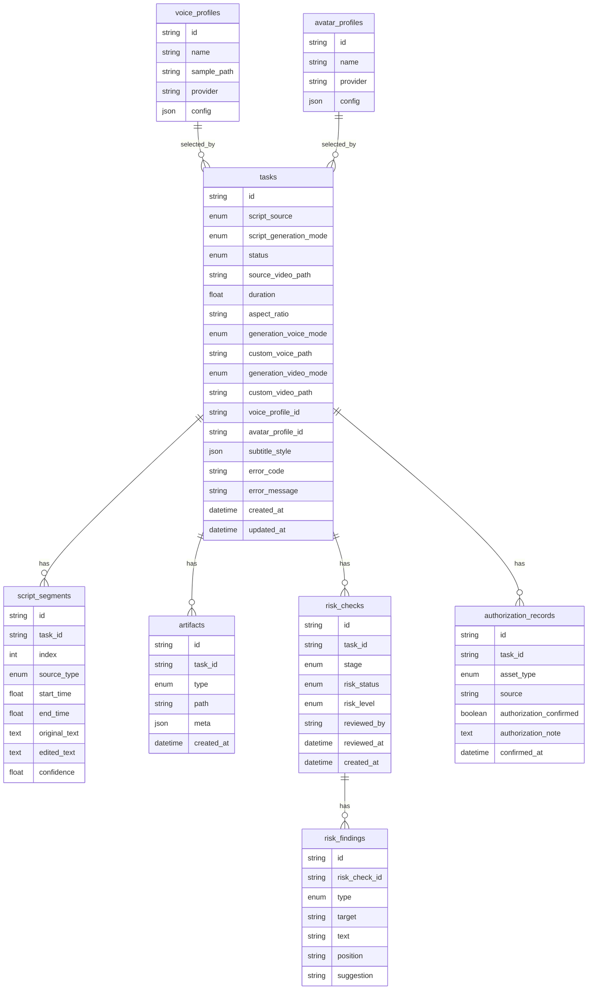
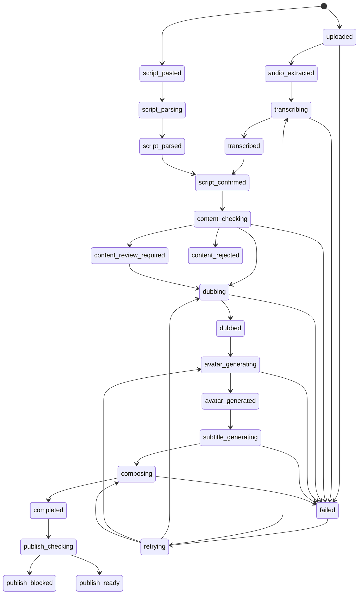

# 数字人视频生成项目数据库技术文档

## 1. 文档说明

本文档从 `docs/technical-architecture.md` 中抽离数据库相关内容，作为后端建模、数据库迁移和任务状态管理的实现依据。

MVP 阶段推荐使用 SQLite 快速跑通单机闭环，正式化后迁移到 MySQL。数据库只保存任务元信息、状态、配置和文件路径，真实视频、音频、字幕、JSON 中间产物统一保存在文件存储中。

## 2. 数据库设计原则

- 文件产物和数据库状态分离：数据库不保存大文件内容，只保存路径、类型和必要元信息。
- 任务状态驱动流程：Worker 根据 `tasks.status` 判断下一步动作，避免流程逻辑散落在前端或 API 层。
- 用户输入必须可追踪：保留原始识别文本、原始粘贴文本和用户最终确认文本。
- 中间产物可复用：失败重试时优先复用已成功生成的文件，减少重复模型调用。
- 先满足单用户 MVP：账号、多租户、审计日志等能力后续扩展，不在当前核心表中过度设计。

## 3. 实体关系



## 4. 表结构设计

### 4.1 `tasks`

保存生成任务的主状态。前端进度页、Worker 调度、失败重试都以该表为核心。

| 字段 | 类型 | 必填 | 说明 |
| --- | --- | --- | --- |
| `id` | string | 是 | 任务 ID，建议使用 UUID 或 ULID。 |
| `script_source` | enum | 是 | 文案来源：`video_asr` / `pasted_subtitle` / `pasted_script`。 |
| `script_generation_mode` | enum | 否 | 文案生成方式：`full_script` / `timed_segments`，默认 `full_script`。 |
| `status` | enum | 是 | 当前任务状态，详见“任务状态机”。 |
| `source_video_path` | string | 否 | 原始视频路径，仅上传视频任务需要。 |
| `duration` | float | 否 | 原视频时长或最终生成音频时长，单位秒。 |
| `aspect_ratio` | string | 否 | 输出比例，例如 `16:9`、`9:16`、`1:1`。 |
| `generation_voice_mode` | enum | 否 | 音色来源：`uploaded_voice` / `preset_voice`。 |
| `custom_voice_path` | string | 否 | 用户上传音色样本路径，仅 `uploaded_voice` 需要。 |
| `custom_voice_prompt_text` | text | 否 | 上传音色样本对应的逐字文本，用于 CosyVoice zero-shot 克隆。 |
| `generation_video_mode` | enum | 否 | 成片素材来源：`uploaded_video` / `preset_avatar`。 |
| `custom_video_path` | string | 否 | 用户上传自拍视频路径，仅 `uploaded_video` 需要。 |
| `voice_profile_id` | string | 否 | 选择的音色 ID，对应 `voice_profiles.id`。 |
| `avatar_profile_id` | string | 否 | 选择的数字人 ID，对应 `avatar_profiles.id`。 |
| `subtitle_style` | json | 否 | 字幕样式配置，例如字体大小、位置、颜色。 |
| `error_code` | string | 否 | 失败错误码，任务失败时写入。 |
| `error_message` | string | 否 | 面向用户的中文失败说明，避免暴露内部敏感信息。 |
| `created_at` | datetime | 是 | 创建时间。 |
| `updated_at` | datetime | 是 | 更新时间。 |

实现注意：

- `status` 每次变更都要同步更新 `updated_at`。
- `error_code` 和 `error_message` 只在 `failed` 状态下对前端展示。
- MVP 可以先不建独立配置表，将生成配置保存在 `tasks` 的配置字段中；当配置版本变多时再拆表。
- 如果使用 `uploaded_voice` 或 `uploaded_video`，必须有对应授权记录；如果使用 `preset_voice` 或 `preset_avatar`，可不写用户上传授权记录。

### 4.2 `script_segments`

保存文案段落。Whisper 识别、粘贴字幕解析、用户编辑后的文本都统一转换为段落结构。

| 字段 | 类型 | 必填 | 说明 |
| --- | --- | --- | --- |
| `id` | string | 是 | 段落 ID。 |
| `task_id` | string | 是 | 所属任务 ID，对应 `tasks.id`。 |
| `index` | int | 是 | 段落顺序，从 0 或 1 开始需在实现中统一。 |
| `source_type` | enum | 是 | 片段来源：`whisper` / `pasted_subtitle` / `pasted_script` / `manual_edit`。 |
| `start_time` | float | 否 | 开始时间，单位秒。纯文本初始解析时可为空。 |
| `end_time` | float | 否 | 结束时间，单位秒。纯文本初始解析时可为空。 |
| `original_text` | text | 是 | 原始识别或粘贴文本。 |
| `edited_text` | text | 否 | 用户编辑并确认后的文本。 |
| `confidence` | float | 否 | Whisper 置信度，仅 ASR 来源可能有值。 |

实现注意：

- 用户编辑文案时，不覆盖 `original_text`，只更新 `edited_text`。
- 用户调整分段顺序后，要重新写入连续的 `index`，避免前端排序异常。
- 确认文案时，后续生成优先使用 `edited_text`，为空时回退到 `original_text`。
- `script_generation_mode=full_script` 时，推荐保存为单条 `script_segments`，`index=1`，`edited_text` 为完整文案，最大 5000 字。
- `script_generation_mode=timed_segments` 时，按分段保存多条记录，保留 `start_time` / `end_time` 用于字幕和节奏对齐。

### 4.3 `artifacts`

保存任务产物路径，包括输入文件、中间文件和最终文件。

| 字段 | 类型 | 必填 | 说明 |
| --- | --- | --- | --- |
| `id` | string | 是 | 产物 ID。 |
| `task_id` | string | 是 | 所属任务 ID，对应 `tasks.id`。 |
| `type` | enum | 是 | 产物类型，详见“产物类型枚举”。 |
| `path` | string | 是 | 文件路径，可以是本地路径或对象存储 key。 |
| `meta` | json | 否 | 文件元信息，例如时长、大小、格式、分辨率。 |
| `created_at` | datetime | 是 | 创建时间。 |

实现注意：

- 下载接口应通过 `artifacts.id` 找到文件，不直接信任前端传入路径。
- 如果后续迁移到 S3 / MinIO，`path` 可以保存 object key，下载接口负责生成短期签名链接。

### 4.4 `voice_profiles`

保存音色配置，供前端配置页展示和生成任务引用。

| 字段 | 类型 | 必填 | 说明 |
| --- | --- | --- | --- |
| `id` | string | 是 | 音色 ID。 |
| `name` | string | 是 | 前端展示名称。 |
| `sample_path` | string | 否 | 音色样本路径。 |
| `provider` | string | 是 | 当前默认 `cozyvoice`。 |
| `config` | json | 否 | 模型参数，例如说话人、语速、音量等。 |

### 4.5 `avatar_profiles`

保存数字人配置，供前端配置页展示和生成任务引用。

| 字段 | 类型 | 必填 | 说明 |
| --- | --- | --- | --- |
| `id` | string | 是 | 数字人 ID。 |
| `name` | string | 是 | 前端展示名称。 |
| `provider` | string | 是 | 当前默认 `heygem`。 |
| `config` | json | 否 | 数字人参数，例如素材路径、分辨率、姿态配置等。 |

### 4.6 `risk_checks`

保存每次内容风险审核或发布前合规审核的汇总结果。

| 字段 | 类型 | 必填 | 说明 |
| --- | --- | --- | --- |
| `id` | string | 是 | 风险审核 ID。 |
| `task_id` | string | 是 | 所属任务 ID，对应 `tasks.id`。 |
| `stage` | enum | 是 | 审核阶段：`input` / `script` / `audio` / `avatar` / `compose` / `pre_publish`。 |
| `risk_status` | enum | 是 | `passed` / `warning` / `blocked` / `manual_review`。 |
| `risk_level` | enum | 是 | `low` / `medium` / `high`。 |
| `risk_types` | json | 否 | 本次命中的风险类型数组，例如 `sensitive_keyword`、`privacy`。 |
| `reviewed_by` | string | 否 | `system` / `user` / `admin`。 |
| `reviewed_at` | datetime | 否 | 人工确认或系统审核完成时间。 |
| `created_at` | datetime | 是 | 创建时间。 |

### 4.7 `risk_findings`

保存风险审核中的具体命中项，方便前端定位和用户修改。

| 字段 | 类型 | 必填 | 说明 |
| --- | --- | --- | --- |
| `id` | string | 是 | 风险命中 ID。 |
| `risk_check_id` | string | 是 | 对应 `risk_checks.id`。 |
| `type` | enum | 是 | 风险类型，例如 `copyright` / `portrait` / `voice` / `sensitive_keyword` / `privacy` / `platform_rule`。 |
| `target` | string | 是 | 命中对象，例如 `script`、`title`、`cover`、`video_frame`。 |
| `text` | text | 否 | 命中的关键词、文本或说明。 |
| `position` | string | 否 | 命中位置，例如第几段、哪个字段、视频时间点。 |
| `suggestion` | text | 否 | 面向用户的修改建议。 |

### 4.8 `authorization_records`

保存素材授权确认记录，用于声音、肖像、视频、字幕和图片等素材的合规留痕。

当前 MVP 交互中，创建任务页不强制写入授权记录；只有用户在配置页选择上传自己的音色样本或上传自己拍的视频时，才要求勾选授权确认，并分别写入 `voice` / `video` 类型记录。

| 字段 | 类型 | 必填 | 说明 |
| --- | --- | --- | --- |
| `id` | string | 是 | 授权记录 ID。 |
| `task_id` | string | 是 | 所属任务 ID，对应 `tasks.id`。 |
| `asset_type` | enum | 是 | `video` / `script` / `voice` / `avatar` / `image`。 |
| `source` | string | 是 | `user_upload` / `preset` / `third_party`。 |
| `authorization_confirmed` | boolean | 是 | 用户是否确认拥有授权。 |
| `authorization_note` | text | 否 | 用户或系统记录的授权说明。 |
| `confirmed_at` | datetime | 是 | 确认时间。 |

## 5. 枚举定义

### 5.1 文案来源 `script_source`

| 值 | 说明 |
| --- | --- |
| `video_asr` | 上传参考视频，通过 Whisper 自动识别文案。 |
| `pasted_subtitle` | 用户粘贴带时间戳或分段结构的字幕。 |
| `pasted_script` | 用户粘贴纯文案。 |

### 5.2 片段来源 `source_type`

| 值 | 说明 |
| --- | --- |
| `whisper` | Whisper 识别生成的片段。 |
| `pasted_subtitle` | 粘贴字幕解析生成的片段。 |
| `pasted_script` | 粘贴纯文案切分生成的片段。 |
| `manual_edit` | 用户手动调整后的片段。 |

### 5.2.1 文案生成方式 `script_generation_mode`

| 值 | 说明 |
| --- | --- |
| `full_script` | 默认模式，完整原视频文案作为单段文本保存，最多 5000 字。 |
| `timed_segments` | 分段时间轴模式，按多个时间点保存文案片段。 |

### 5.2.2 音色来源 `generation_voice_mode`

| 值 | 说明 |
| --- | --- |
| `uploaded_voice` | 用户上传自己的音色样本，需要授权确认记录，并填写样本文本以优先走 zero-shot。 |
| `preset_voice` | 使用系统默认音色。 |

### 5.2.3 成片素材来源 `generation_video_mode`

| 值 | 说明 |
| --- | --- |
| `uploaded_video` | 用户上传自己拍的视频作为成片素材，需要授权确认记录。 |
| `preset_avatar` | 使用系统默认数字人生成口播画面。 |

### 5.3 产物类型 `artifact.type`

| 值 | 说明 | 建议路径 |
| --- | --- | --- |
| `source_video` | 用户上传的原始视频。 | `input/source.mp4` |
| `audio` | 从视频中提取的音频。 | `intermediate/source_audio.wav` |
| `transcript` | Whisper 或文案解析结果。 | `intermediate/whisper_segments.json` / `intermediate/parsed_segments.json` |
| `confirmed_script` | 用户确认后的文案。 | `intermediate/confirmed_script.json` |
| `timeline` | 校准后的字幕时间线。 | `intermediate/timeline.json` |
| `tts_audio` | CozyVoice 生成的配音。 | `intermediate/tts_audio.wav` |
| `avatar_video` | HeyGem 生成的数字人视频。 | `intermediate/avatar_video.mp4` |
| `subtitle` | 字幕文件。 | `intermediate/subtitle.srt` / `intermediate/subtitle.ass` |
| `final_video` | 最终成片。 | `output/final_with_subtitle.mp4` |

当前独立服务接入不新增数据库表。Worker 会继续通过 `artifacts` 记录服务产物：音频提取后写入 `audio`，Whisper 标准化结果写入 `transcript`，CosyVoice / HeyGem / FFmpeg 的输出分别写入 `tts_audio`、`avatar_video`、`subtitle` 和 `final_video`。

### 5.4 错误码 `error_code`

| 值 | 说明 | 是否建议自动重试 |
| --- | --- | --- |
| `VALIDATION_ERROR` | 输入格式、文件大小、视频时长不符合要求。 | 否 |
| `ASR_FAILED` | Whisper 识别失败。 | 是，1-2 次 |
| `SCRIPT_PARSE_FAILED` | 粘贴字幕解析失败。 | 否，需用户调整文本 |
| `TTS_FAILED` | CozyVoice 配音失败。 | 是，1-2 次 |
| `AVATAR_FAILED` | HeyGem 数字人生成失败。 | 是，1-2 次 |
| `COMPOSE_FAILED` | FFmpeg 合成失败。 | 谨慎，先检查输入和命令 |
| `RISK_CHECK_FAILED` | 内容风险审核失败。 | 是，先判断是否为第三方服务异常 |
| `CONTENT_BLOCKED` | 内容风险阻断，不能继续生成或发布。 | 否，需用户修改内容 |
| `DISTRIBUTE_FAILED` | 分发失败。 | 是，视平台限制而定 |

### 5.5 风险状态 `risk_status`

| 值 | 说明 |
| --- | --- |
| `passed` | 未发现明显风险，可以继续。 |
| `warning` | 存在提示性风险，建议用户修改或确认。 |
| `blocked` | 高风险内容，禁止继续生成或发布。 |
| `manual_review` | 需要用户或管理员人工确认。 |

### 5.6 风险类型 `risk_findings.type`

| 值 | 说明 |
| --- | --- |
| `copyright` | 文案、视频、字幕、课程、影视内容等版权风险。 |
| `portrait` | 肖像、公众人物、未成年人等形象风险。 |
| `voice` | 声音克隆、名人音色、身份误导等声音风险。 |
| `sensitive_keyword` | 涉政、涉黄、涉暴、赌博、医疗金融等关键词风险。 |
| `privacy` | 手机号、身份证、地址、订单号、聊天记录等隐私泄露风险。 |
| `platform_rule` | 平台规则、AI 标识、平台水印、Logo、二维码等发布风险。 |

## 6. 任务状态机

### 6.1 状态流



### 6.2 状态说明

| 状态 | 面向用户说明 | 主要写入方 |
| --- | --- | --- |
| `uploaded` | 已上传参考视频。 | API |
| `audio_extracted` | 已提取音频。 | Worker |
| `transcribing` | 正在识别文案。 | Worker |
| `transcribed` | 文案识别完成，等待用户确认。 | Worker |
| `script_pasted` | 已提交粘贴文案。 | API |
| `script_parsing` | 正在解析文案。 | API / Worker |
| `script_parsed` | 文案解析完成，等待用户确认。 | API / Worker |
| `script_confirmed` | 用户已确认最终文案。 | API |
| `content_checking` | 正在进行内容风险审核。 | Worker |
| `content_review_required` | 存在需要用户确认的风险。 | Worker / API |
| `content_rejected` | 内容风险被阻断，需要用户修改。 | Worker |
| `dubbing` | 正在生成配音。 | Worker |
| `dubbed` | 配音生成完成。 | Worker |
| `avatar_generating` | 正在生成数字人口播视频。 | Worker |
| `avatar_generated` | 数字人视频生成完成。 | Worker |
| `subtitle_generating` | 正在生成字幕。 | Worker |
| `composing` | 正在合成最终视频。 | Worker |
| `publish_checking` | 正在进行发布前合规检查。 | Worker |
| `publish_blocked` | 发布前检查未通过，不能直接发布。 | Worker |
| `publish_ready` | 发布前检查通过或已人工确认。 | Worker / API |
| `completed` | 成片已生成。 | Worker |
| `failed` | 任务失败，可查看原因或重试。 | API / Worker |
| `retrying` | 正在从失败节点重试。 | API / Worker |

## 7. 索引与约束建议

### 7.1 主键与外键

- `tasks.id`、`script_segments.id`、`artifacts.id`、`risk_checks.id`、`risk_findings.id`、`authorization_records.id`、`voice_profiles.id`、`avatar_profiles.id` 使用字符串主键。
- `script_segments.task_id` 外键关联 `tasks.id`。
- `artifacts.task_id` 外键关联 `tasks.id`。
- `risk_checks.task_id` 外键关联 `tasks.id`。
- `risk_findings.risk_check_id` 外键关联 `risk_checks.id`。
- `authorization_records.task_id` 外键关联 `tasks.id`。
- `tasks.voice_profile_id` 外键关联 `voice_profiles.id`，允许为空。
- `tasks.avatar_profile_id` 外键关联 `avatar_profiles.id`，允许为空。

### 7.2 唯一约束

- `script_segments(task_id, index)` 建议唯一，确保同一任务内段落顺序不重复。
- `authorization_records(task_id, asset_type)` 可按业务设置唯一，避免同一任务同类素材重复确认。
- `voice_profiles.name` 和 `avatar_profiles.name` 可按业务需要设置唯一，MVP 阶段不强制。

### 7.3 查询索引

| 表 | 索引 | 用途 |
| --- | --- | --- |
| `tasks` | `(status, updated_at)` | 后台任务扫描、异常任务排查。 |
| `tasks` | `(created_at)` | 任务列表按创建时间排序。 |
| `script_segments` | `(task_id, index)` | 前端获取文案段落并按顺序展示。 |
| `artifacts` | `(task_id, type)` | 查询某个任务的指定产物。 |
| `artifacts` | `(created_at)` | 排查产物生成时间。 |

## 8. 文件存储边界

建议目录结构如下：

```text
storage/
  tasks/
    {task_id}/
      input/
        source.mp4
        pasted_script.txt
        voice_sample.wav
        self_video.mp4
      intermediate/
        source_audio.wav
        whisper_segments.json
        parsed_segments.json
        confirmed_script.json
        timeline.json
        tts_audio.wav
        avatar_video.mp4
        subtitle.srt
        subtitle.ass
      output/
        final_with_subtitle.mp4
        final_without_subtitle.mp4
```

数据库与文件存储的边界：

- `tasks.source_video_path` 保存原始视频路径，便于任务入口快速判断。
- `tasks.custom_voice_path` 保存配置页上传的音色样本路径，`tasks.custom_video_path` 保存配置页上传的自拍视频路径。
- `artifacts.path` 保存所有输入、中间和输出产物路径，是下载和重试的主要依据。
- `script_segments` 保存可编辑文案结构，`confirmed_script.json` 保存生成时使用的最终快照。
- 文件名不要直接使用用户上传名称，统一由后端按 `task_id` 和产物类型生成安全路径。

## 9. 迁移与扩展建议

### 9.1 ORM 模型建议

后端建议使用 SQLAlchemy 定义 ORM 模型，Pydantic 只用于 API 请求和响应，不直接替代数据库模型。

推荐映射：

| 数据表 | SQLAlchemy Model | Repository |
| --- | --- | --- |
| `tasks` | `TaskModel` | `task_repository.py` |
| `script_segments` | `ScriptSegmentModel` | `segment_repository.py` |
| `artifacts` | `ArtifactModel` | `artifact_repository.py` |
| `risk_checks` | `RiskCheckModel` | `risk_repository.py` |
| `risk_findings` | `RiskFindingModel` | `risk_repository.py` |
| `authorization_records` | `AuthorizationRecordModel` | `risk_repository.py` |
| `voice_profiles` | `VoiceProfileModel` | `profile_repository.py` |
| `avatar_profiles` | `AvatarProfileModel` | `profile_repository.py` |

实现注意：

- `domain/` 中定义状态枚举和业务规则，`db/models.py` 只负责持久化结构。
- Service 层通过 Repository 读写数据，不在路由中直接使用 SQLAlchemy session。
- JSON 字段在 SQLite 中可以先按文本 / JSON 兼容方式保存，迁移 MySQL 后使用 `JSON` 类型。

### 9.2 Alembic 迁移建议

建议从项目早期就引入 Alembic，即使 MVP 先用 SQLite，也能保留结构变更记录。

迁移规则：

- 每次新增表、字段、索引或枚举值，都生成独立 migration。
- migration 文件名要说明业务目的，例如 `add_task_generation_config_fields`。
- 不在 migration 中写入大文件路径扫描、模型推理等业务逻辑。
- 从 SQLite 切换到 MySQL 前，先在测试数据库完整跑一遍 migration。

### 9.3 Docker 数据卷建议

Docker Compose 中建议至少使用两个持久化位置：

| 数据卷 | 挂载位置 | 用途 |
| --- | --- | --- |
| `mysql_data` | `/var/lib/mysql` | MySQL 数据持久化。 |
| `./storage` 或 `storage_data` | `/app/storage` | 上传文件、中间产物和最终视频。 |

`api` 和 `worker` 必须共享同一个 `/app/storage` 挂载，否则 API 写入的 artifact path 在 Worker 容器中不可见。正式迁移到 S3 / MinIO 后，`artifacts.path` 建议保存 object key，而不是容器内本地路径。

### 9.4 SQLite 到 MySQL

MVP 使用 SQLite 时，字段类型可以保持简化；正式迁移 MySQL 时建议：

- enum 可先使用字符串字段，避免早期频繁变更枚举导致迁移复杂。
- JSON 字段迁移为 MySQL `JSON`，便于保存字幕样式、模型参数、文件元信息和风险类型数组。
- 时间字段统一使用 UTC 存储，前端按本地时区展示。
- 字符集建议统一使用 `utf8mb4`，避免中文、emoji、特殊符号保存异常。
- 风险命中明细建议拆成 `risk_findings` 独立表，不要只塞进一个大 JSON，避免后续按风险类型、命中字段和任务追溯时难以查询。

### 9.5 后续可扩展表

| 表 | 触发时机 | 说明 |
| --- | --- | --- |
| `users` | 需要账号系统时 | 保存用户身份与权限。 |
| `task_events` | 需要完整审计和排障时 | 记录每次状态变更、错误、重试。 |
| `generation_configs` | 生成配置版本变复杂时 | 从 `tasks` 中拆出配置快照。 |
| `distribution_records` | 已接入 social-auto-upload 分发时 | 保存发布平台、标题简介标签、发布状态、外部链接、失败原因和原始返回。 |
| `risk_rules` | 需要动态维护审核规则时 | 保存敏感词、平台规则、行业规则和启停状态。 |
| `admin_reviews` | 需要后台人工审核时 | 保存管理员审核意见、处理结果和复核记录。 |

## 10. 实现检查清单

- 创建任务时必须写入 `tasks`，并为输入文件创建对应 `artifacts`。
- Worker 每完成一个阶段，先保存产物，再更新任务状态。
- 失败时必须写入 `error_code` 和面向用户的 `error_message`。
- 重试时根据已有 `artifacts` 判断恢复节点，不默认从头开始。
- 前端展示文案时按 `script_segments.index` 排序。
- 下载文件时只接受 `artifact_id`，不要暴露任意路径读取能力。

## 11. KrLongAI 对齐字段（migration 20260618_0003）

`tasks` 新增：`source_url`、`pipeline_mode`、`pipeline_stage`、`voice_speed`、`background_music_mode`、`ai_watermark_enabled`、`export_without_subtitle`、`avatar_engine`。

## 12. 速度优化字段（migration 20260621_0005）

`tasks` 新增：`generation_quality`（`fast` | `full`，默认 `full`）、`tuilionnx_sync_offset`（整数，默认 0）。

`pipeline_stage.stage_timings` JSON 结构示例：

```json
{
  "dubbing": { "duration_ms": 130000, "finished_at": "2026-06-21T12:00:00" }
}
```

`distribution_records` 新增：`cover_artifact_id`。

`artifacts.type` 新增枚举：`cover`、`final_video_no_subtitle`。
