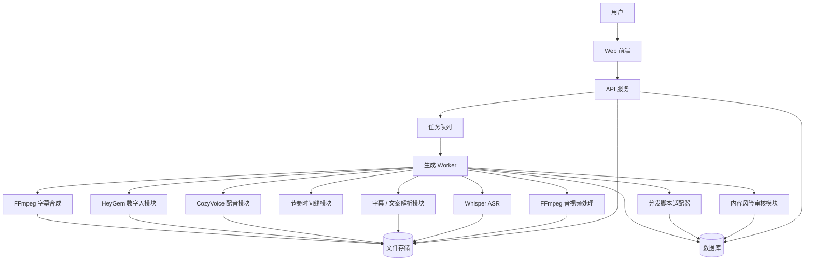
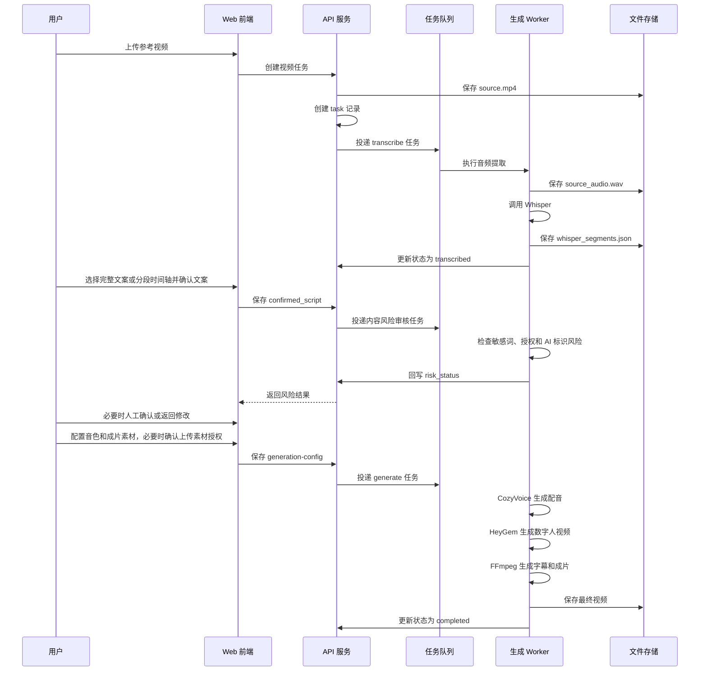
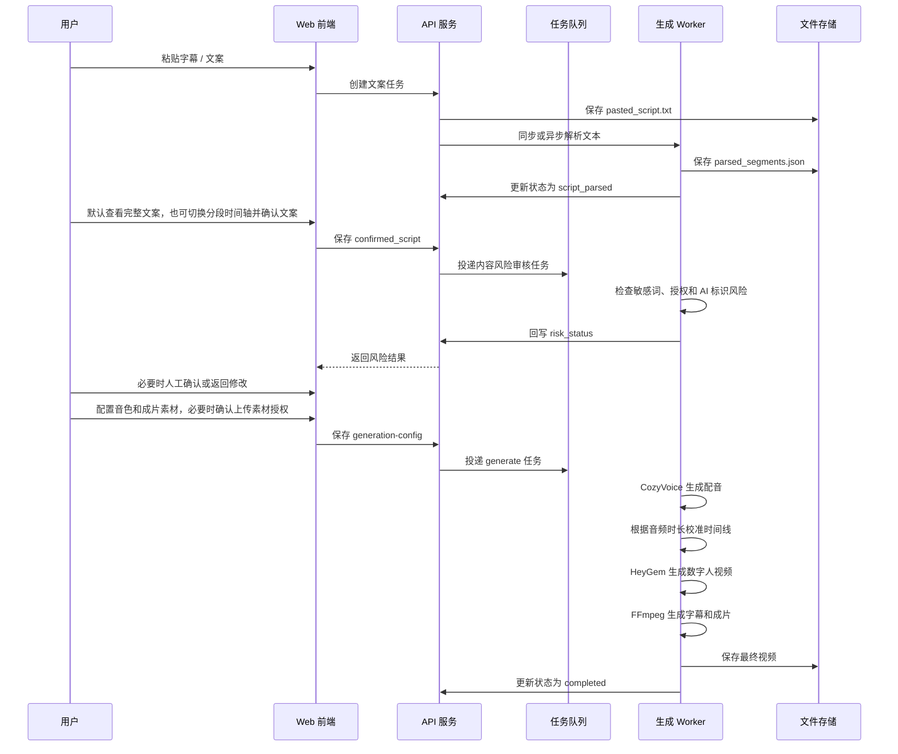
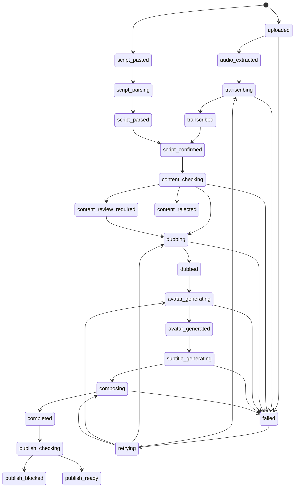
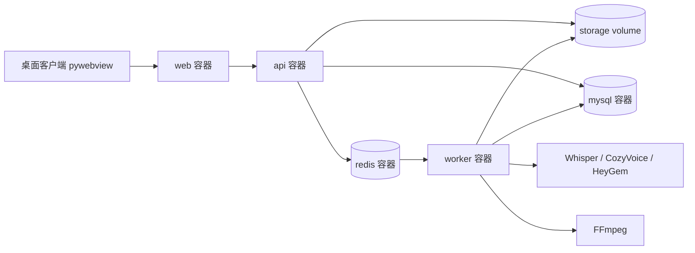
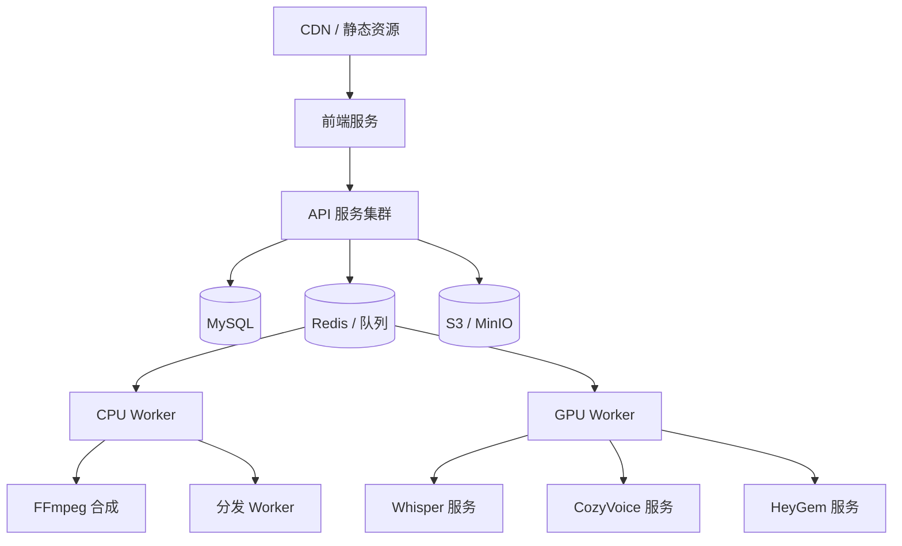
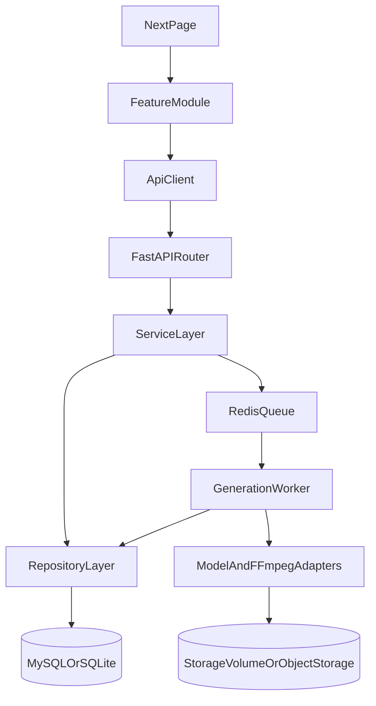

# 数字人视频生成项目技术架构设计

## 1. 架构目标

本架构服务于“参考视频 / 粘贴字幕文案 -> 数字人口播视频”的生成流程。设计重点不是一开始做复杂平台，而是先跑通稳定的生成闭环，并让 Whisper、CozyVoice、HeyGem、FFmpeg 和后续分发脚本都能作为独立模块接入、替换和扩展。

### 1.1 核心目标

- 支持两种文案来源：参考视频自动识别、用户粘贴字幕 / 文案。
- 支持长耗时任务异步执行，避免前端等待超时。
- 每个环节保存中间产物，失败后可以从最近成功节点重试。
- 各开源组件通过适配器封装，避免业务代码直接绑定具体命令或 SDK。
- MVP 可以本地单机部署，后续可以拆成多服务、多 GPU、多任务队列架构。

### 1.2 设计原则

- 先单机闭环，再服务化扩展。
- 任务状态驱动流程，避免链路混乱。
- 文件产物和数据库状态分离，数据库只保存元信息和路径。
- 所有外部模型调用都有统一错误处理、日志和重试策略。
- 用户输入内容必须可追踪：保留原始识别文本 / 原始粘贴文本 / 用户最终确认文本。

## 2. 总体架构



### 2.1 MVP 推荐形态

MVP 阶段推荐使用一个 Web 应用 + 一个后台 Worker + 本地文件存储：

- 前端：React + TypeScript + Vite，用于任务创建、文案编辑、状态查看、成片预览。
- 后端 API：Python FastAPI，负责接口、任务编排、状态管理。
- 异步任务：Celery + Redis，或更轻量的 RQ + Redis。
- 数据库：开发期 SQLite，正式使用 MySQL。
- 文件存储：开发期本地目录，后续可迁移到 S3 / MinIO。
- 音视频处理：FFmpeg 命令行。
- 模型服务：Whisper、CosyVoice、HeyGem 通过 HTTP 服务或本地 CLI 适配器接入；FFmpeg 在 Worker 内执行。
- 背景音乐：CC0-1.0 Music 作为本地音乐库扫描，配置页可选择是否混入成片。
- 分发能力：social-auto-upload 通过 `sau` CLI 适配器接入，发布前检查通过后由用户手动触发。

## 3. 核心模块

### 3.1 Web 前端

职责：

- 创建任务：选择“上传视频”或“粘贴字幕 / 文案”。
- 上传参考视频；在配置页上传自定义音色样本或用户自拍视频。
- 展示 Whisper 识别结果或粘贴文案解析结果。
- 支持用户在完整文案模式和分段时间轴模式之间切换，编辑并确认最终文案。
- 展示任务状态、失败原因和重试入口。
- 播放和下载最终视频。

关键页面：

- 任务创建页
- 文案确认页
- 配音与数字人配置页
- 生成进度页
- 成片结果页

### 3.2 API 服务

职责：

- 提供前端调用接口。
- 做基础参数校验和权限校验。
- 创建和更新任务状态。
- 保存用户输入、文案片段、生成配置和产物路径。
- 投递异步生成任务。
- 查询生成进度和产物信息。

API 服务不直接执行耗时模型任务，只负责调度和状态管理。

### 3.3 任务队列

职责：

- 承载长耗时任务，例如识别、配音、数字人生成、视频合成。
- 支持失败重试。
- 支持任务阶段拆分。
- 支持后续按任务类型分配不同 Worker，例如 GPU Worker、CPU Worker、分发 Worker。

MVP 阶段可以先使用单队列：

- `generation`：完整视频生成流程。

后续建议拆分为：

- `asr`：语音识别任务。
- `tts`：配音任务。
- `avatar`：数字人生成任务。
- `compose`：字幕和视频合成任务。
- `distribute`：平台分发任务。

### 3.4 生成 Worker

职责：

- 根据任务状态执行下一步处理。
- 调用各模型适配器。
- 保存中间产物。
- 更新数据库状态。
- 捕获错误并写入失败原因。

Worker 是整个生成链路的核心，不建议把流程逻辑散落在 API 层或前端。

### 3.5 文件存储

职责：

- 保存用户上传的视频。
- 保存提取后的音频。
- 保存 Whisper 识别 JSON。
- 保存用户确认后的文案 JSON。
- 保存 CozyVoice 生成音频。
- 保存 HeyGem 生成视频。
- 保存字幕文件。
- 保存最终成片。

建议目录结构：

```text
storage/
  tasks/
    {task_id}/
      input/
        source.mp4
        pasted_script.txt
        voice_sample.wav
        self_video.mp4
      intermediate/
        source_audio.wav
        whisper_segments.json
        parsed_segments.json
        confirmed_script.json
        timeline.json
        tts_audio.wav
        avatar_video.mp4
        subtitle.srt
        subtitle.ass
      output/
        final_with_subtitle.mp4
        final_without_subtitle.mp4
```

## 4. 生成流程设计

### 4.1 上传视频自动识别流程



### 4.2 粘贴字幕 / 文案流程



## 5. 模块适配器设计

### 5.1 FFmpeg 适配器

职责：

- 从视频中提取音频。
- 获取视频元信息。
- 生成字幕文件。
- 合成最终视频。

建议接口：

```python
class FFmpegAdapter:
    def probe_video(self, video_path: str) -> VideoMeta:
        pass

    def extract_audio(self, video_path: str, output_path: str) -> str:
        pass

    def burn_subtitle(self, video_path: str, subtitle_path: str, output_path: str) -> str:
        pass

    def compose_final_video(self, base_video_path: str, audio_path: str, subtitle_path: str, output_path: str) -> str:
        pass
```

`base_video_path` 可以是 HeyGem 生成的数字人视频，也可以是用户在配置页上传的自拍视频。

Windows 合成注意事项：`subtitles` 滤镜路径必须使用引号包裹的 POSIX 形式（如 `subtitles='C\:/Users/.../subtitle.srt'`）。若仅用反斜杠转义，libass 会把路径解析成无效参数并返回 `Invalid argument`（exit -22）。烧录字幕时需同时指定 `original_size`（与成片分辨率一致，如 `1080x1920`）和 `MarginV`，否则 `font_size` 会被错误放大且无法贴底。

### 5.2 Whisper 适配器

职责：

- 接收音频文件。
- 输出带时间戳的文案片段。

建议接口：

```python
class WhisperAdapter:
    def transcribe(self, audio_path: str, language: str = "zh") -> list[ScriptSegment]:
        pass
```

### 5.3 文案解析适配器

职责：

- 解析用户粘贴的 SRT、带序号字幕、纯文本。
- 统一转换为 `ScriptSegment`。
- 对无时间戳文本生成初始分段。
- 支持保存 `script_generation_mode`：
  - `full_script`：默认模式，把完整文案作为单段确认文本，最多 5000 字。
  - `timed_segments`：保留分段和时间点，用于字幕对齐和按参考视频节奏拼接。

解析优先级：

1. 如果包含 SRT 时间戳，保留原始时间戳。
2. 如果包含序号和换行，按字幕块解析。
3. 如果是纯文本，按换行、句号、问号、感叹号切分。
4. 如果单段过长，按最大字数继续拆分。

### 5.4 时间线模块

职责：

- 维护文案片段和字幕时间。
- 对 Whisper 片段保留原时间戳。
- 对粘贴字幕优先使用原时间戳。
- 对纯文案根据配音音频时长重新分配时间。

注意：这里不要只按字数平均分配。更合理的 MVP 方案是先按字数给初始时间，再用最终 TTS 音频总时长做比例缩放。

### 5.5 CozyVoice 适配器

职责：

- 根据确认后的文案和音色配置生成配音。
- 返回音频文件路径和时长。

建议接口：

```python
class CozyVoiceAdapter:
    def synthesize(self, text: str, voice_config: VoiceConfig, output_path: str) -> AudioResult:
        pass
```

### 5.6 HeyGem 适配器

职责：

- 根据配音音频和数字人配置生成口播视频。
- 返回数字人视频路径。

建议接口：

```python
class HeyGemAdapter:
    def generate_avatar_video(self, audio_path: str, avatar_config: AvatarConfig, output_path: str) -> VideoResult:
        pass
```

当任务选择 `generation_video_mode=uploaded_video` 时，可跳过 HeyGem 数字人生成，改由合成模块把用户自拍视频、生成配音和字幕进行拼接；当选择 `preset_avatar` 时，继续使用 HeyGem 生成数字人口播画面。

### 5.7 分发脚本适配器

职责：

- 接收最终成片和发布元信息。
- 调用 dist*script。
- 回写发布状态。

MVP 阶段只预留接口，不强制实现。

### 5.8 内容风险审核适配器

职责：

- 对用户粘贴文案、ASR 识别文案、最终确认文案进行基础敏感词检测。
- 对标题、简介、标签、封面文字等发布元信息进行发布前合规检查。
- 保存风险审核结果、命中位置、风险类型和用户确认记录。
- 对需要人工确认或被阻断的内容，向 API 层返回结构化风险状态。

MVP 阶段可以先使用本地关键词词库和规则配置，后续再接入 OCR、抽帧审核、人脸 / Logo / 水印检测或第三方内容安全服务。

## 6. 数据模型设计

本节只说明数据模型在整体架构中的边界和关系，详细字段、索引、约束、迁移策略见 `docs/database-technical-design.md`。

核心实体：

- `tasks`：生成任务主表，保存文案来源、任务状态、生成配置、失败原因和时间信息。
- `script_segments`：文案段落表，保存 Whisper 识别结果、粘贴文案解析结果和用户编辑后的文本。
- `artifacts`：产物表，保存输入文件、中间产物和最终视频的类型、路径和元信息。
- `voice_profiles`：音色配置表，保存 CozyVoice 相关音色参数。
- `avatar_profiles`：数字人配置表，保存 HeyGem 相关数字人参数。

设计边界：

- 数据库只保存元信息和路径，不保存视频、音频、字幕等大文件内容。
- 文件统一进入 `storage/tasks/{task_id}` 或后续对象存储，数据库通过 `artifacts.path` 关联。
- `tasks.status` 是 Worker 执行下一阶段的核心依据，不建议在前端或 API 层硬编码生成流程。
- 用户原始输入和最终确认文本必须都能追踪，避免后续排查时无法判断 ASR、解析和人工编辑之间的差异。

## 7. 状态机设计



**2026-06 守卫模块 [`Backend/app/services/task_guards.py`](Backend/app/services/task_guards.py)：**

- `assert_not_in_generation`：生成阶段禁止改文案 / 重识别 / 跑合规。
- `assert_can_retry_generation`：按 `error_code` 分流重试；拒绝重复 `retrying`。
- `save_segments` 编辑已确认文案时回退为 `transcribed`。

**异步投递统一入口 [`Backend/app/services/task_enqueue.py`](Backend/app/services/task_enqueue.py)：** 桌面 `BackgroundTasks` / 生产 Celery `.delay()`。

**一键流水线 [`run_full_pipeline_task`](Backend/app/workers/tasks.py)：** 生成前自动 `check_script_risk` + `confirm_script`；需人工确认时停于 `content_review_required`。

失败重试时不要从头开始，应该根据已存在的中间产物决定从哪个节点恢复。

如果不希望主状态机过度复杂，MVP 也可以将审核结果保存为 `risk_status`、`risk_level`、`risk_reasons` 等附加字段。主状态只在需要阻断生成或发布时切换到 `content_review_required`、`content_rejected`、`publish_blocked`。

## 8. API 设计草案

本节只说明 API 在整体架构中的分层和职责，详细请求参数、响应结构、错误码和前后端联调约定见 `docs/api-interface-design.md`。

### 8.1 API 分层原则

- API 层负责接收前端请求、做基础校验、读写数据库、保存文件路径和投递异步任务。
- API 层不直接执行 Whisper、CozyVoice、HeyGem、FFmpeg 等长耗时任务。
- 前端创建任务后通过任务状态接口轮询进度，不能用同步请求等待生成完成。
- 文件下载必须通过 `artifact_id` 由后端校验后返回，不允许前端直接拼接文件路径。

### 8.2 接口分类

| 分类 | 主要职责 | 示例 |
| --- | --- | --- |
| 任务创建 | 上传视频或提交粘贴文案，创建任务并投递识别 / 解析任务。 | `POST /api/tasks/video`、`POST /api/tasks/script` |
| 文案编辑 | 获取、保存和确认文案段落。 | `GET /api/tasks/{task_id}/segments`、`POST /api/tasks/{task_id}/confirm-script` |
| 生成配置 | 读取音色 / 数字人列表，保存生成参数。 | `GET /api/voice-profiles`、`POST /api/tasks/{task_id}/generation-config` |
| 生成控制 | 启动生成、查询状态、失败重试。 | `POST /api/tasks/{task_id}/generate`、`GET /api/tasks/{task_id}` |
| 产物访问 | 查询产物列表和下载文件。 | `GET /api/tasks/{task_id}/artifacts`、`GET /api/artifacts/{artifact_id}/download` |
| 风险审核 | 查询风险结果、人工确认风险、执行发布前合规检查。 | `GET /api/tasks/{task_id}/risk-checks`、`POST /api/tasks/{task_id}/pre-publish-check` |

## 9. 错误处理与重试

### 9.1 错误分类

- `VALIDATION_ERROR`：输入格式、文件大小、视频时长不符合要求。
- `ASR_FAILED`：Whisper 识别失败。
- `SCRIPT_PARSE_FAILED`：粘贴字幕解析失败。
- `TTS_FAILED`：CozyVoice 配音失败。
- `AVATAR_FAILED`：HeyGem 数字人生成失败。
- `COMPOSE_FAILED`：FFmpeg 合成失败。
- `RISK_CHECK_FAILED`：内容风险审核失败。
- `CONTENT_BLOCKED`：内容风险阻断，禁止继续生成或发布。
- `DISTRIBUTE_FAILED`：分发失败。

### 9.2 重试策略

- 输入校验失败不自动重试。
- 模型调用失败可以重试 1-2 次。
- FFmpeg 命令失败不盲目重试，先记录命令、输入文件和错误输出。
- 重试时复用已成功的中间产物，避免重复消耗 GPU 资源。

## 10. 部署架构

### 10.1 Docker 化 MVP 部署



MVP 阶段建议直接使用 Docker Compose 管理依赖服务，避免 Redis、MySQL、FFmpeg、Python 环境和 Node 环境在不同机器上不一致。

推荐服务：

| 服务 | 技术 | 端口 / 数据 | 职责 |
| --- | --- | --- | --- |
| `web` | React + Vite，代码位于 `Frontend/` | `5173` | 前端页面；日常由桌面客户端 pywebview 加载，样式与 Web 版一致。 |
| `api` | FastAPI + Uvicorn，代码位于 `Backend/` | `8000` | REST API、参数校验、数据库读写、任务投递。 |
| `worker` | Celery Worker | 共享 `storage` volume | 执行 ASR、配音、数字人、字幕和合成任务。 |
| `redis` | Redis | `6379` | 队列 broker 和任务状态缓存。 |
| `mysql` | MySQL | `3306` + `mysql_data` volume | 正式化数据库。MVP 也可以临时换成 SQLite。 |
| `storage` | Docker volume / bind mount | `./storage:/app/storage` | 保存上传文件、中间产物和最终成片。 |
| `whisper` | FastAPI + OpenAI Whisper | `8001`，profile: `whisper` / `models` | 提供 `/health` 和 `/transcribe`，返回标准化文案时间轴。 |
| `cosyvoice` | FastAPI 桥接 CosyVoice | `8002`，profile: `cosyvoice` / `models` | 提供 `/health` 和 `/synthesize`，通过上游 HTTP 或命令模板生成配音。 |
| `heygem` | FastAPI 桥接 HeyGem | `8003`，profile: `heygem` / `models` | 提供 `/health` 和 `/generate`，通过上游 HTTP 或命令模板生成数字人视频。 |

关键约束：

- `api` 和 `worker` 必须挂载同一个 `storage` volume，否则 API 写入的路径 Worker 无法读取。
- `api` 和 `worker` 使用同一套环境变量，例如数据库连接、Redis 地址、存储根路径、模型调用方式。
- `whisper`、`cosyvoice`、`heygem` 默认不随基础服务启动，开发时按需使用 `docker compose --profile models up` 或单独 profile 启动。
- CosyVoice / HeyGem 服务不内置大模型仓库，使用 `COSYVOICE_COMMAND_TEMPLATE`、`HEYGEM_COMMAND_TEMPLATE` 或上游 URL 桥接外部开源项目，避免主仓库膨胀。
- MySQL 数据使用独立 `mysql_data` volume 持久化，避免容器重建后数据丢失。
- 开发期可使用 bind mount 方便查看产物；正式部署建议改为对象存储或专门的持久化卷。

### 10.2 Docker Compose 结构建议

```text
services:
  web:
    build:
      context: .
      dockerfile: Frontend/Dockerfile
    ports: ["5173:5173"]
    depends_on: [api]

  api:
    build:
      context: .
      dockerfile: Backend/Dockerfile
    ports: ["8000:8000"]
    depends_on: [mysql, redis]
    volumes:
      - ./storage:/app/storage

  worker:
    build:
      context: .
      dockerfile: Backend/worker.Dockerfile
    depends_on: [mysql, redis]
    volumes:
      - ./storage:/app/storage

  redis:
    image: redis:7

  mysql:
    image: mysql:8.4
    volumes:
      - mysql_data:/var/lib/mysql

volumes:
  mysql_data:
```

注意：这里是架构建议，不要求一开始就把所有 Dockerfile 写完。最小可用版本可以先启动 `api`、`worker`、`redis`，数据库用 SQLite 文件，等数据结构稳定后切 MySQL。

### 10.3 模型服务容器化策略

Whisper、CozyVoice、HeyGem 的接入方式可能不同，建议分阶段处理：

1. MVP：由 `worker` 容器调用本地命令、SDK 或外部 HTTP 服务，先跑通生成闭环。
2. 单机 GPU：把 `worker` 做成 GPU 容器，挂载模型文件目录，并配置 NVIDIA Container Toolkit。
3. 多服务：拆成 `asr-worker`、`tts-worker`、`avatar-worker`、`compose-worker`，按队列和资源类型分工。
4. 生产化：Whisper、CozyVoice、HeyGem 分别作为模型服务部署，Worker 只负责请求模型服务、保存产物和更新状态。

如果本机 GPU 资源有限，可以先用轻量 Whisper 模型，或者让数字人生成调用外部 HeyGem 服务，不要因为模型部署复杂度阻塞主流程验证。

当前实现中的真实生成接入方式：

- Whisper 服务直接封装 `openai-whisper`，`WHISPER_MODEL` 控制模型大小，`WHISPER_LANGUAGE` 控制识别语言。
- CosyVoice 服务支持三种真实路径：`COSYVOICE_UPSTREAM_MODE=official_fastapi` 时调用官方 runtime FastAPI 的 `/inference_sft`、`/inference_zero_shot` 或 `/inference_cross_lingual`；配置 `COSYVOICE_MODEL_DIR` 时尝试在服务进程内加载 `cosyvoice.cli.cosyvoice.AutoModel`；配置 `COSYVOICE_COMMAND_TEMPLATE` 时执行外部仓库命令。
- HeyGem 服务支持官方视频合成接口：配置 `HEYGEM_VIDEO_BASE_URL` 后调用 `/easy/submit` 并轮询 `/easy/query`，通过 `HEYGEM_DEFAULT_VIDEO_PATH` 或 `HEYGEM_AVATAR_PROFILE_MAP` 绑定默认数字人视频素材。

本地真实生成建议启动顺序：

1. 先启动 `api`、`worker`、`mysql`、`redis`（桌面模式为 SQLite + 同步 Celery）。
2. Windows 一键安装 CosyVoice：`scripts/windows/安装CosyVoice.bat`，或 `python scripts/windows/setup_cosyvoice.py install && start`；将 `COSYVOICE_UPSTREAM_URL=http://127.0.0.1:50000`、`ALLOW_MODEL_SERVICE_STUB_OUTPUT=false` 写入 `.env`；8002 health 应显示 `upstream-http`。
3. 数字人口型：安装 Docker Desktop 后部署 [Duix.Avatar](https://github.com/duixcom/Duix-Avatar)（`:8383`），设置 `HEYGEM_VIDEO_BASE_URL`；若暂无 Docker，可在配置页选择「上传自拍视频」模式，仅依赖 CosyVoice 真实配音 + FFmpeg 合成。
4. 将 `USE_STUB_MODEL_ADAPTERS=false`，重启 `scripts/windows/重启模型服务.bat` 或一键启动脚本。

### 10.4 后续生产部署



扩展方向：

- Whisper、CozyVoice、HeyGem 分别部署成独立模型服务。
- GPU Worker 只处理模型推理。
- CPU Worker 处理 FFmpeg、字幕、文件整理和分发。
- 文件统一存储到对象存储。

## 11. 安全与合规

### 11.1 输入安全

- 限制上传文件类型、大小和时长。
- 对粘贴文本限制最大长度。
- 文件名不直接使用用户上传名称，统一生成安全路径。
- FFmpeg 命令参数必须由后端拼装，不允许用户输入直接进入命令。

### 11.2 内容合规

- 创建任务页不强制统一授权确认，避免阻塞参考视频 / 文案录入；当用户在配置页上传自己的音色样本或自拍视频时，必须提示并记录声音、肖像、视频等素材授权确认。
- 对声音克隆样本和用户自拍视频保存授权来源字段。
- 后续如平台要求，应支持添加 AI 生成标识。
- 对用户输入、ASR 文案、确认文案、标题、简介、标签和封面文字进行基础敏感词检测。
- 对版权、肖像、声音、隐私、平台水印、品牌 Logo、医疗金融等高风险内容输出结构化风险结果。
- 对 `warning` 和 `manual_review` 风险要求用户人工确认后继续。
- 对 `blocked` 风险禁止自动发布，必要时禁止继续生成。
- 风险审核记录必须保存命中位置、风险类型、建议处理方式和用户确认结果。

### 11.3 凭证安全

- 平台账号 token 不写入日志。
- 分发平台凭证使用环境变量或密钥管理服务。
- 下载链接建议使用短期有效签名链接。

## 12. 日志与可观测性

每个任务至少记录：

- `task_id`
- 当前阶段
- 开始时间和结束时间
- 输入文件路径
- 输出文件路径
- 调用的模块名称
- 错误码和面向用户的错误说明

建议日志分层：

- 用户可见状态：简短中文说明。
- 开发排查日志：完整错误、命令退出码、模型返回信息。
- 性能日志：每个阶段耗时。

## 13. 推荐代码目录

```text
digital-human/
  Frontend/
    package.json
    vite.config.ts
    src/
      pages/
      routes/
      components/
      lib/
        api-client/
      types/
  Backend/
    pyproject.toml
    alembic.ini
    app/
      main.py
      api/
        routers/
          tasks.py
          segments.py
          profiles.py
          artifacts.py
          risk_checks.py
      core/
        config.py
        logging.py
      db/
        session.py
        models.py
        migrations/
      services/
        task_service.py
        segment_service.py
        profile_service.py
        risk_service.py
      workers/
        celery_app.py
        tasks.py
      adapters/
        ffmpeg.py
        whisper.py
        cozyvoice.py
        heygem.py
      domain/
      repositories/
      schemas/
  storage/
  docs/
  docker-compose.yml
  .env.example
  README.md
```

前后端代码包使用 `Frontend/` 和 `Backend/` 顶层目录，方便非技术读者和新协作者快速识别职责边界。后端内部仍保留 `app/api/routers/` 作为 FastAPI 路由分层名称，这里的 `api` 指 HTTP 接口层，不再代表仓库级后端包。

### 13.1 推荐框架

| 层级 | 推荐框架 / 工具 | 用途 |
| --- | --- | --- |
| Web 前端 | React + TypeScript + Vite | 页面路由、表单交互、任务进度和结果预览。 |
| 前端请求 | Fetch / Axios + Zod | 封装 API client，并对请求和响应做类型校验。 |
| 后端 API | FastAPI + Pydantic | 提供 REST API、参数校验和 OpenAPI 文档。 |
| ORM | SQLAlchemy | 定义数据库模型和封装查询。 |
| 数据迁移 | Alembic | 管理 SQLite / MySQL schema 变更。 |
| 任务队列 | Celery + Redis | 承载 ASR、TTS、数字人生成和视频合成等长耗时任务。 |
| 文件处理 | FFmpeg | 提取音频、生成字幕、合成成片。 |
| 模型适配 | Whisper / CozyVoice / HeyGem | 通过 adapter 封装命令行、SDK 或 HTTP 服务差异。 |

MVP 阶段如果希望更轻量，可以用 RQ + Redis 替代 Celery。但如果后续明确需要任务路由、重试策略、任务监控和多 Worker 扩展，优先使用 Celery。

前端主选型推荐 `React + TypeScript + Vite`，原因是招聘市场覆盖面广、工程结构轻、维护成本低，也适合当前这种后台工作台型应用。后续如果需要官网 SEO、服务端渲染或全栈页面能力，再升级到 Next.js。

### 13.2 后端模块职责

| 目录 / 模块 | 职责 |
| --- | --- |
| `app/main.py` | 创建 FastAPI 应用，注册路由、中间件和启动检查。 |
| `app/api/routers/` | 按业务资源拆分 HTTP 路由，只处理请求解析、权限校验和响应转换。 |
| `app/schemas/` | Pydantic 请求 / 响应模型，保证接口输入输出结构稳定。 |
| `app/services/` | 业务编排层，例如创建任务、确认文案、保存生成配置、投递任务。 |
| `app/repositories/` | 数据访问层，封装 SQLAlchemy 查询，避免 Service 直接拼 SQL。 |
| `app/domain/` | 领域对象、状态枚举和跨层共享的业务规则。 |
| `app/adapters/` | 第三方能力适配层，封装 FFmpeg、Whisper、CozyVoice、HeyGem 的调用方式。 |
| `app/adapters/risk_check_adapter.py` | 内容安全适配层，封装本地词库、OCR、第三方审核服务等风险检查能力。 |
| `app/workers/` | Celery / RQ Worker 入口和生成流程任务，负责执行耗时阶段。 |
| `app/db/` | 数据库 session、ORM model 和 Alembic 迁移。 |
| `app/core/` | 配置、日志、安全、路径等基础设施。 |

核心约束：`routers` 不直接调用模型适配器，`workers` 不直接处理 HTTP 请求，`services` 负责把 API、数据库、队列和文件存储串起来。

### 13.3 前端模块职责

| 目录 / 模块 | 职责 |
| --- | --- |
| `src/pages/` | 页面组件目录，例如任务创建、文案确认、生成进度、结果页。 |
| `src/routes/` | React Router 路由配置，集中维护页面路径和权限边界。 |
| `src/components/` | 可复用 UI 组件，例如上传控件、进度条、视频播放器。 |
| `src/features/` | 按业务场景组织页面逻辑，减少所有逻辑堆在页面文件中。 |
| `src/lib/api-client/` | 统一封装后端 API 调用、错误处理和响应类型。 |
| `src/lib/validators/` | 前端表单校验，例如文件类型、文本长度、必填配置。 |
| `src/types/` | 与后端响应对应的 TypeScript 类型。 |

前端应把“用户看得懂的状态文案”和“后端真实状态枚举”分开管理，状态枚举以 API 返回为准，展示文案可以在前端映射。

### 13.4 代码调用关系



这条调用关系用于约束代码边界：页面不直接碰数据库，API 路由不直接跑模型，Worker 不绕过 Repository 修改核心状态。

## 14. 技术选型建议

### 14.1 推荐 MVP 选型

- 后端：Python + FastAPI + Pydantic
- 前端：React + TypeScript + Vite
- 队列：Redis + Celery，极简 MVP 可用 RQ
- 数据库：SQLite 起步，MySQL 正式化
- ORM / 迁移：SQLAlchemy + Alembic
- 文件存储：本地目录起步，MinIO / S3 正式化
- 容器化：Docker + Docker Compose
- 音视频：FFmpeg
- ASR：Whisper
- 配音：CozyVoice
- 数字人：HeyGem

### 14.2 为什么后端建议 Python

Whisper、CozyVoice、HeyGem 这类模型生态更偏 Python，早期用 Python 做编排可以减少跨语言调用成本。前端只负责交互，耗时生成逻辑集中在 Worker 中，后续如果需要性能或工程治理，再拆服务也比较自然。

## 15. 分阶段落地计划

### 阶段 1：最小链路

- 建立任务表、产物表和本地存储目录。
- 支持上传视频。
- 使用 FFmpeg 提取音频。
- 调用 Whisper 生成文案片段。
- 支持粘贴字幕 / 文案并解析为片段。
- 支持文案编辑和确认。

### 阶段 2：生成链路

- 接入 CozyVoice 生成配音。
- 接入 HeyGem 生成数字人视频。
- 生成 SRT / ASS 字幕。
- 使用 FFmpeg 合成最终视频。

### 阶段 3：可用性增强

- 增加任务进度页。
- 增加失败节点重试。
- 增加音色和数字人配置管理。
- 增加字幕样式配置。

### 阶段 4：平台化

- 支持批量任务。
- 支持对象存储。
- 拆分 CPU Worker 和 GPU Worker。
- 对接 dist*script 分发模块。

## 16. 待确认技术问题

- HeyGem 当前对接方式是命令行、HTTP 服务，还是 SDK？
- CozyVoice 是否需要独立 GPU 服务，还是可以和主 Worker 同机运行？
- Whisper 使用本地模型还是 API 化服务？
- dist*script 的准确项目名称和调用方式是什么？
- MVP 是否必须支持用户上传自定义数字人形象？
- 是否需要账号系统和多用户隔离？
- 成片生成速度的最低可接受标准是多少？

## 17. KrLongAI 对齐模块（2026-06-18）

新增适配器与服务：

- `UrlDownloadAdapter`：yt-dlp 对标链接下载
- `DeepSeekAdapter`：文案仿写、发布元信息、封面文案
- `CoverAdapter`：FFmpeg 抽帧 + Pillow 封面
- `PlaywrightPublisher`：抖音/小红书/视频号浏览器发布
- `TuiliONNXAdapter`：第二数字人引擎（Ultralight-Digital-Human 本地 ONNX，`local-onnx` 模式）；快速模式传 `compress_inference` / `sync_offset` / `inference_scale`
- `CozyVoiceAdapter`：克隆分段并行合成（快速模式 max_workers=3，40 字/段）
- `pipeline_service` + `tasks.run_full_pipeline`：一键追爆款编排；支持上传音色、生成前暂停于 `await_config`

前端任务创建页 `/tasks/new` 为唯一入口（分步创作）；任务列表 `/tasks`。配置页支持语速、随机 BGM、字幕样式烧录、AI 水印。

**桌面交付形态**：`scripts/windows/一键启动数字人追爆.bat` → `combined_launcher.py`，本地 SQLite + uvicorn/Vite + pywebview 窗口。当 `USE_STUB_MODEL_ADAPTERS=false` 时，启动器会额外拉起 CosyVoice(8002) 与 HeyGem(8003) 包装服务；若 `.env` 未配置上游地址，则自动启用占位输出（静音 WAV / ffmpeg 黑底视频）以跑通合成链路。
