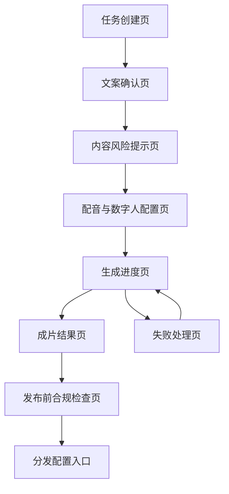
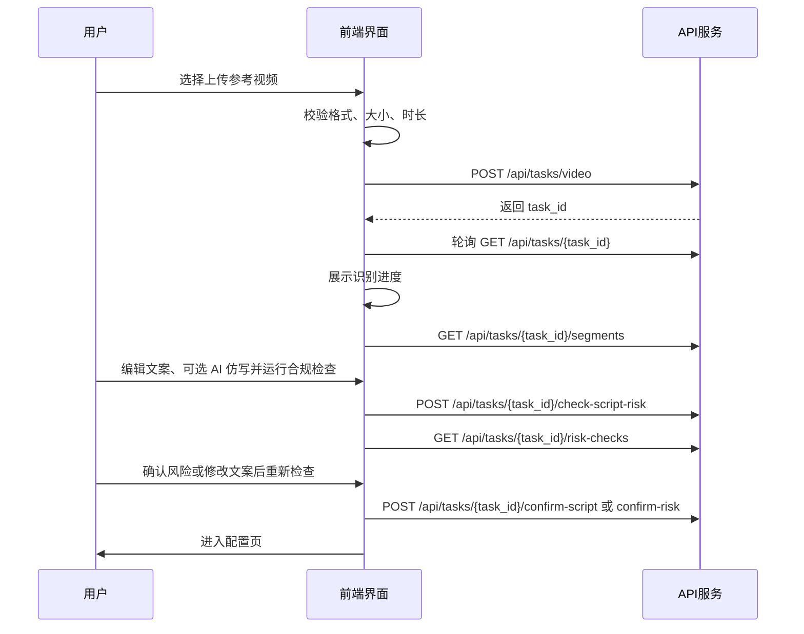
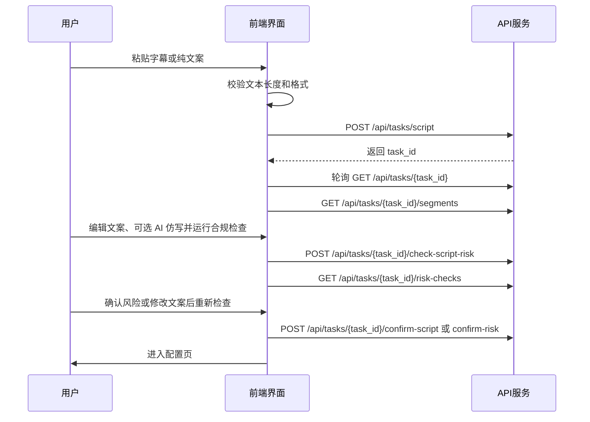

# 数字人视频生成项目 UI 设计文档

## 1. 文档说明

本文档定义数字人视频生成系统的 UI 设计方向、页面结构、核心交互、组件规范和状态展示规则，供 `Frontend/` 中的 React + TypeScript + Vite 前端实现使用。

关联文档：

- 产品需求：`docs/digital-human-video-generator-prd.md`
- 技术架构：`docs/technical-architecture.md`
- API 接口：`docs/api-interface-design.md`

## 2. 产品定位与设计目标

系统服务于“参考视频 / 粘贴字幕文案 -> 数字人口播视频”的生成流程。UI 的核心目标不是做复杂的视频剪辑软件，而是让用户清楚知道当前要做什么、系统正在做什么、失败后可以怎么恢复。

设计目标：

- 降低生成门槛：用户不用理解 Whisper、CozyVoice、HeyGem、FFmpeg，也能按步骤完成生成。
- 强化过程感：长耗时任务必须有清晰状态、阶段说明和可预期反馈。
- 保护用户输入：文案编辑、音色选择、数字人配置等关键步骤要支持确认和回看。
- 面向非技术用户：所有错误提示、按钮文案、状态说明优先使用自然中文。
- 为后续扩展留空间：预留批量任务、分发平台、模板配置和多用户能力。

## 3. 视觉方向

### 3.1 设计概念

推荐视觉方向：**冷静的创作控制台**。

界面应像一个面向内容创作者的“生成工作台”，既有视频制作的专业感，又避免传统剪辑软件的复杂压迫感。整体风格偏深色、聚焦、分层清晰，重点内容使用高亮色提示用户当前步骤和生成状态。

关键词：

- 专业但不冰冷
- 生成过程清晰可见
- 视频预览优先
- 步骤化、可恢复
- 少装饰，多反馈

### 3.2 色彩建议

| 用途 | 色值建议 | 说明 |
| --- | --- | --- |
| 页面背景 | `#0B1020` | 深色主背景，降低视频预览区域的干扰。 |
| 面板背景 | `#121A2E` | 卡片、表单、编辑器背景。 |
| 强调色 | `#35D0BA` | 主按钮、当前步骤、成功进度。 |
| 辅助强调 | `#7C5CFF` | AI 生成、模型处理、队列状态。 |
| 警告色 | `#FFB020` | 低置信度、待确认、可重试提示。 |
| 错误色 | `#FF5A6A` | 失败状态、校验错误。 |
| 主文本 | `#F5F7FA` | 标题和关键内容。 |
| 次文本 | `#AAB4C5` | 说明文字、辅助信息。 |
| 边框线 | `#25314A` | 卡片边框、分割线。 |

注意：主界面避免大面积高饱和渐变。强调色只用于引导视线，不要让状态色和品牌色混淆。

### 3.3 字体与排版

- 中文字体：优先使用系统默认中文字体，保证跨平台可读性。
- 英文 / 数字：可使用更有技术感的字体，例如 `IBM Plex Sans` 或 `Geist`。
- 标题：字重 600-700，强调层级。
- 正文：14-16px，行高 1.6，方便阅读文案和错误信息。
- 数字状态：任务进度、时长、文件大小可以使用等宽数字风格，便于扫读。

## 4. 信息架构

### 4.1 页面地图



### 4.2 页面列表

| 页面 | 路由建议 | 核心目标 |
| --- | --- | --- |
| 任务创建页 | `/tasks/new` | 选择输入方式，上传视频或粘贴文案，创建任务。 |
| 文案与合规页 | `/tasks/{task_id}/script` | 编辑/仿写文案，并在同页运行 AI 合规检查；通过后进入配置。 |
| 内容风险提示页（兼容） | `/tasks/{task_id}/risk-review` | 旧链接自动重定向到文案与合规页。 |
| 配音与数字人配置页 | `/tasks/{task_id}/config` | 选择默认 / 自定义音色、默认数字人 / 自自拍视频、比例和字幕样式。 |
| 生成进度页 | `/tasks/{task_id}/progress` | 展示生成阶段、耗时、失败原因和重试入口。 |
| 成片结果页 | `/tasks/{task_id}/result` | 预览最终视频，下载成片和字幕文件。 |
| 发布前合规检查页 | `/tasks/{task_id}/pre-publish` | 检查标题、简介、标签、封面和平台规则。 |
| 分发配置入口 | `/tasks/{task_id}/publish` | 后续扩展，用于平台发布配置。 |

## 5. 核心用户流程

### 5.1 上传视频识别流程



### 5.2 粘贴文案生成流程



## 6. 页面设计

### 6.0 页面布局总原则

MVP 优先面向桌面端，采用“顶部导航 + 步骤条 + 主工作区 + 底部操作栏”的稳定结构。这样用户在不同页面之间切换时，始终知道自己处在哪一步、下一步要做什么。

通用桌面布局：

```text
┌────────────────────────────────────────────────────────────────────────────┐
│ 顶部导航：Digital Human Studio                         任务 / 模板 / 分发 │
├────────────────────────────────────────────────────────────────────────────┤
│ 步骤条：创建任务 → 文案与合规 → 配置生成 → 生成中 → 查看结果      │
├────────────────────────────────────────────────────────────────────────────┤
│                                                                            │
│  主工作区：根据当前页面切换为上传、编辑、配置、进度或预览                  │
│                                                                            │
├────────────────────────────────────────────────────────────────────────────┤
│ 底部操作栏：返回 / 保存草稿 / 下一步 / 开始生成 / 下载                    │
└────────────────────────────────────────────────────────────────────────────┘
```

布局原则：

- 顶部导航保持轻量，MVP 不放太多入口，避免干扰生成流程。
- 步骤条始终可见，让用户明确当前处于哪一步。
- 主工作区优先保证视频预览、文案编辑和生成状态的可读性。
- 底部操作栏只放当前页面最关键的 1-3 个动作。
- 右侧栏用于说明、状态、配置摘要和错误提示，不承载核心编辑操作。

### 6.1 任务创建页

页面目标：让用户快速选择“上传视频”或“粘贴文案”，并明确输入要求。

桌面布局线框：

```text
┌────────────────────────────────────────────────────────────────────────────┐
│ Digital Human Studio                                      任务 / 模板 / 分发 │
├────────────────────────────────────────────────────────────────────────────┤
│ 创建任务 → 文案与合规 → 配置生成 → 生成中 → 查看结果               │
├──────────────────┬───────────────────────────────────────┬─────────────────┤
│ 输入方式          │ 主输入区                                │ 创建说明          │
│                  │                                       │                 │
│ ● 上传参考视频    │ ┌───────────────────────────────────┐   │ 支持格式          │
│ ○ 粘贴字幕/文案   │ │ 拖拽视频到这里，或点击选择文件       │   │ MP4 / MOV         │
│                  │ │                                   │   │                 │
│ 输出比例          │ │ 上传后展示：文件名 / 时长 / 大小     │   │ 时长限制          │
│ [9:16][16:9][1:1]│ └───────────────────────────────────┘   │ 3 分钟以内        │
│                  │                                       │                 │
│                  │ 或：多行文本输入框                      │ 授权提示          │
│                  │ 错误提示显示在主输入区底部              │ 配置页上传时确认   │
├──────────────────┴───────────────────────────────────────┴─────────────────┤
│                                             取消        创建任务            │
└────────────────────────────────────────────────────────────────────────────┘
```

布局建议：

- 左侧：输入方式选择卡片。
- 中间：上传区或文本输入区。
- 右侧：生成说明、格式要求、后续授权提示。
- 底部固定操作栏：重置、创建任务按钮。

核心模块：

| 模块 | 内容 | 交互 |
| --- | --- | --- |
| 输入方式切换 | 上传参考视频 / 粘贴字幕文案 | 切换时保留已输入内容，但提交前只使用当前选中方式。 |
| 视频上传区 | 拖拽上传、点击选择、格式说明 | 上传后展示文件名、时长、大小、分辨率和音频轨状态。 |
| 文案输入区 | 多行文本框、字数统计、格式提示 | 支持粘贴 SRT、带序号字幕、纯文本。 |
| 输出比例 | `9:16` / `16:9` / `1:1` | MVP 默认 `9:16`。 |
| 创建说明 | 支持格式、时长、风险检查说明、后续授权说明 | 创建页不强制授权确认；上传音色或自拍视频时在配置页确认。 |

关键文案：

- 主标题：`创建数字人口播视频`
- 副标题：`上传参考视频自动识别文案，或直接粘贴你已有的字幕 / 口播稿。`
- 主按钮：`创建任务`

异常提示：

- 文件格式不支持：`当前仅支持 MP4 / MOV，请重新选择文件。`
- 文件过大：`文件超过限制，请上传 3 分钟以内的视频。`
- 文案为空：`请先粘贴字幕或口播文案。`
- 视频链接无效：`请输入有效的视频链接，需以 http:// 或 https:// 开头`，显示在主输入区底部，不放在右侧说明面板。

### 6.1.1 内容风险提示（已并入文案与合规页）

原独立页面 `/tasks/{task_id}/risk-review` 已合并进文案与合规页；旧链接会自动重定向。合规检查面板位于文案编辑器下方，包含：

| 模块 | 内容 | 交互 |
| --- | --- | --- |
| 风险摘要 | 通过 / 警告 / 阻断 / 需人工确认 | 不只使用颜色，必须配中文状态和风险数量。 |
| 风险命中列表 | 风险类型、命中对象、命中位置、处理建议 | 点击命中项可跳转到对应文案段落或字段。 |
| 人工确认区 | 确认说明、风险接受提示 | 仅 `warning` / `manual_review` 可确认继续。 |
| 阻断提示 | 高风险原因和修改入口 | `blocked` 不提供继续按钮，只能返回修改。 |

关键文案：

- 低风险通过：`未发现明显内容风险，可以继续配置生成。`
- 警告确认：`系统发现部分内容可能存在风险，请确认你已了解并愿意继续。`
- 阻断提示：`当前内容存在高风险，请修改后重新检查。`

### 6.2 文案与合规页

页面目标：在同一页完成文案编辑、AI 仿写与合规检查，避免在多个步骤间来回切换。

桌面布局线框：

```text
┌────────────────────────────────────────────────────────────────────────────┐
│ Digital Human Studio                                      任务 / 模板 / 分发 │
├────────────────────────────────────────────────────────────────────────────┤
│ 创建任务 → 文案与合规 → 配置生成 → 生成中 → 查看结果               │
├──────────────────────┬─────────────────────────────────────────────────────┤
│ 参考视频              │ 文案工作区（模式 / 统计 / 仿写 / 编辑 / 合规检查） │
│                      │ [DeepSeek 仿写工具条]                               │
│                      │ [多行完整文案编辑框]                                 │
│                      │ AI 合规检查摘要 + 命中列表 + [运行合规检查]          │
├──────────────────────┴─────────────────────────────────────────────────────┤
│                         返回创建        保存草稿        继续配置生成        │
└────────────────────────────────────────────────────────────────────────────┘
```

布局建议：

- 顶部：任务步骤条，当前步骤高亮为「文案与合规」。
- 左侧：原视频 / 原文案来源预览。
- 右侧工作区：文案模式、仿写、编辑器、合规检查面板、底部操作栏。

核心交互：

- 先执行 DeepSeek 仿写，仿写成功后自动展开 AI 合规检查区并触发 `POST /api/tasks/{task_id}/check-script-risk`。
- 合规命中项在文案编辑器内以红色高亮标注，行号区同步标红；点击风险卡片可跳转到正文对应位置。
- 自动/手动保存：触发 `PUT /api/tasks/{task_id}/segments`。
- 继续配置生成：AI 检查通过时调用 `POST /api/tasks/{task_id}/confirm-script`；需人工确认时调用风险确认接口。
- 文案修改后：提示「文案已修改，请重新运行 AI 合规检查」。

关键文案：

- 识别中：页面顶部仅展示 **一个** `TranscribeProgressPanel`（百分比 + 步骤条）；左侧视频区与工作区只显示简短提示，不再重复进度条。
- 保存成功：`文案已保存。`
- 合规通过：`未发现明显内容风险，可以继续配置生成。`
- 「继续配置生成」一键完成：保存文案 → 自动合规检查（如需）→ 确认并跳转配置页，无需先点「运行合规检查」。
- warning / manual_review 提示项无需改文案，点击「继续配置生成」会自动确认；仅 blocked 需修改后重试。
- 阻断提示：`当前内容存在高风险，请修改后重新检查。`

### 6.3 配音与数字人配置页

页面目标：让用户完成音色来源、成片素材、数字人备选和字幕样式选择。

桌面布局线框：

```text
┌────────────────────────────────────────────────────────────────────────────┐
│ Digital Human Studio                                      任务 / 模板 / 分发 │
├────────────────────────────────────────────────────────────────────────────┤
│ 创建任务 → 文案与合规 → 配置生成 → 生成中 → 查看结果               │
├──────────────────────────────────────┬─────────────────────────────────────┤
│ 生成配置                              │ 实时预览                             │
│                                      │                                     │
│ 音色选择                              │ ┌─────────────────────────────────┐ │
│ [上传自己的音色][使用默认音色]          │ │ 自拍视频/数字人预览画面            │ │
│ 上传区或默认女声/男声卡片              │ │                                 │ │
│                                      │ │        字幕效果预览               │ │
│ 成片素材                              │ └─────────────────────────────────┘ │
│ [上传自己拍的视频][使用默认数字人]       │                                     │
│                                      │ 配置摘要                             │
│ 输出比例                              │ 音色：待上传音色                      │
│ [9:16][16:9][1:1]                    │ 成片：待上传自拍视频                  │
│                                      │ 字幕：底部 / 白色 / 有描边             │
│ 上传素材授权确认                       │ 配置摘要：文案来源 / 音色 / 成片素材   │
│ □ 我确认拥有素材授权                   │ 字幕样式：字号 / 颜色 / 启用字幕       │
├──────────────────────────────────────┴─────────────────────────────────────┤
│                         返回文案        保存配置        开始生成视频        │
└────────────────────────────────────────────────────────────────────────────┘
```

布局建议：

- 左侧：生成配置表单。
- 右侧：手机画幅预览 + 2×2 配置摘要卡片 + 分组控件（字幕/导出/BGM），侧栏可独立滚动。
- 底部：保存配置、开始生成。

核心模块：

| 模块 | 内容 | 交互 |
| --- | --- | --- |
| 音色选择 | 默认选中 `上传自己的音色`，用于克隆用户音色；支持 WAV / MP3 / M4A，并要求填写“音色样本文本”。`使用默认音色` 可作为快速测试选项 | 调用 `GET /api/voice-profiles`，上传模式保存 `generation_voice_mode=uploaded_voice`、音色样本路径和 `custom_voice_prompt_text`；有样本文本时优先走 zero-shot，系统截取前 5 秒样本。 |
| 成片素材 | `上传自己拍的视频` / `使用默认数字人`；上传模式支持 MP4 / MOV，默认模式展示数字人卡片 | 调用 `GET /api/avatar-profiles`，上传模式保存 `generation_video_mode=uploaded_video` 和自拍视频路径。 |
| 输出比例 | `9:16` / `16:9` / `1:1` | 与任务创建页保持一致，可二次调整。 |
| 字幕样式 | 默认底部、字号 20；支持调整字号、位置、颜色、描边 | 右侧实时预览。 |
| 生成质量 | `快速` / `完整` 两档；快速用于预览短文案，完整用于正式成片 | 保存 `generation_quality`；快速模式推荐 HeyGem，完整模式推荐 TuiliONNX；TuiliONNX 可配置 `tuilionnx_sync_offset`（-10～10 帧）。 |
| 背景音乐 | 可选择 CC0-1.0 Music 曲目或不添加背景音乐，列表展示曲名、来源和可识别到的时长 | 调用 `GET /api/music-tracks`，保存 `background_music_path` 和 `background_music_volume`，由 FFmpeg 合成阶段混音。 |
| 上传素材授权 | 用户上传音色或自拍视频时展示授权确认 | 未上传必需素材或未勾选授权时，用户点击保存 / 开始生成后只提示缺失项。 |
| 生成确认 | 配置完整性检查 | 调用 `POST /api/tasks/{task_id}/generation-config` 后启动生成。 |

按钮策略：

- 默认选中「上传自己的音色」与「上传自己拍的视频」，需补齐素材并勾选授权；可切换为默认音色与数字人快速试跑。
- 步骤条为 5 步（CSS `repeat(5, 1fr)`），与 `StepNav` 对齐。
- 结果页仅 `completed` / `publish_*` 可进入；`<video>` 绑定 `final_video` 产物。
- 配置页失败态：点击右上角失败徽章弹出详情弹窗（含完整 error_message）；页面内不再常驻失败面板。
- 配音失败且 8002 mode=unconfigured 时，提示配置 `ALLOW_MODEL_SERVICE_STUB_OUTPUT=true` 或 `COSYVOICE_UPSTREAM_URL`。
- 一键流水线进度页在 `content_review_required` / `await_config` / `script_confirmed` / `failed` 时停止轮询并展示 CTA；`await_config` 引导用户去配置页上传音色。
- 任务步骤路由统一由 `Frontend/src/lib/taskFlow.ts` 的 `resolveTaskStepPath()` 提供。
- 引导按钮使用 `ScriptGateLink`（programmatic navigate），避免桌面 WebView 内 `<a>` 跳转失效；进入文案页后自动滚到 `#script-compliance`。
- 生成失败（`GENERATION_FAILED`）时，主按钮引导至生成进度页重试，次按钮仍可返回文案页。
- 配置不完整：点击保存/开始后，底部操作栏展示缺失项列表（不再只在右侧侧栏提示）。
- 配置完整：主按钮文案为 `开始生成视频`，成功后跳转生成进度页。

### 6.4 生成进度页

页面目标：在长耗时生成过程中持续给用户明确反馈，失败时给出可恢复路径。

桌面布局线框：

```text
┌────────────────────────────────────────────────────────────────────────────┐
│ Digital Human Studio                                      任务 / 模板 / 分发 │
├────────────────────────────────────────────────────────────────────────────┤
│ 创建任务 → 文案与合规 → 配置生成 → 生成中 → 查看结果               │
├──────────────────────────────────────┬─────────────────────────────────────┤
│ 阶段时间线                            │ 当前阶段详情                         │
│                                      │                                     │
│ ✓ 视频上传                            │ 正在生成数字人口播视频                 │
│ ✓ 文案识别/解析                        │ HeyGem 正在处理口型与画面              │
│ ✓ 文案确认                            │                                     │
│ ✓ 配音生成                            │ 预计还需要：几分钟                     │
│ ● 数字人生成                          │                                     │
│ ○ 字幕生成                            │ 中间产物                              │
│ ○ 视频合成                            │ - confirmed_script.json              │
│ ○ 成片完成                            │ - tts_audio.wav                      │
│                                      │ - avatar_video.mp4 生成中             │
├──────────────────────────────────────┴─────────────────────────────────────┤
│                         返回任务详情        查看日志        失败后重试      │
└────────────────────────────────────────────────────────────────────────────┘
```

失败态布局（2026-06 优化）：

```text
┌────────────────────────────────────────────────────────────────────────────┐
│ [!] 生成失败                                                                │
│     配音生成失败 / 数字人生成失败（按错误类型自动归类）                        │
│                                                                            │
│ 配音服务（CosyVoice）未正常响应，未能生成配音文件。                            │
│ 系统已保留文案和中间产物，修复问题后可重新发起完整生成。                        │
│                                                                            │
│ 建议操作                                                                    │
│ 1. 重启「一键启动」拉起 8002 占位服务                                        │
│ 2. 真实配音需在 .env 配置 COSYVOICE_UPSTREAM_URL                             │
│ 3. 确认端口就绪后点击重新生成                                                │
│                                                                            │
│ 错误码  GENERATION_FAILED                                                   │
│ ▸ 查看技术详情（默认折叠，仅展示原始 error_message）                         │
│                                                                            │
│ [返回检查配置]                                        [重新生成]             │
└────────────────────────────────────────────────────────────────────────────┘
```

前端通过 `parseGenerationFailure()` 解析 `error_code` / `error_message`，避免「CosyVoice 服务调用失败:」空冒号标题，并按配音/数字人/字幕/合成分类给出操作建议。

布局建议：

- 顶部：任务名 / 创建时间 / 输出比例。
- 中间：阶段时间线。
- 右侧：当前阶段说明、预计等待提示、中间产物。
- 底部：取消入口预留、失败重试入口。

阶段时间线：

| 状态 | 展示文案 | 图标状态 |
| --- | --- | --- |
| `uploaded` | 视频已上传，等待识别 | 等待 |
| `audio_extracted` | 音频提取完成 | 成功 |
| `transcribing` | 正在识别文案 | 处理中 |
| `transcribed` | 文案识别完成 | 成功 |
| `script_pasted` | 文案已提交，等待解析 | 等待 |
| `script_parsing` | 正在解析文案 | 处理中 |
| `script_parsed` | 文案解析完成 | 成功 |
| `script_confirmed` | 文案已确认 | 成功 |
| `dubbing` | 正在生成配音 | 处理中 |
| `dubbed` | 配音生成完成 | 成功 |
| `avatar_generating` | 正在生成数字人口播视频 | 处理中 |
| `avatar_generated` | 数字人视频生成完成 | 成功 |
| `subtitle_generating` | 正在生成字幕 | 处理中 |
| `composing` | 正在合成最终视频 | 处理中 |
| `completed` | 成片已生成 | 成功 |
| `failed` | 生成失败 | 失败 |
| `retrying` | 正在重试 | 处理中 |

轮询策略：

- 每 2-5 秒调用 `GET /api/tasks/{task_id}`。
- `completed`：停止轮询并跳转 / 提示进入结果页。
- `failed`：停止轮询，展示 `error_message` 和重试按钮。

失败状态设计：

- 错误摘要：面向用户的中文解释。
- 技术细节：默认折叠，仅展示非敏感信息。
- 主操作：`从失败节点重试`。
- 次操作：`返回检查文案` 或 `重新创建任务`。

### 6.5 成片结果页

页面目标：让用户预览、下载和复用最终产物。

桌面布局线框：

```text
┌────────────────────────────────────────────────────────────────────────────┐
│ Digital Human Studio                                      任务 / 模板 / 分发 │
├────────────────────────────────────────────────────────────────────────────┤
│ 创建任务 → 文案与合规 → 配置生成 → 生成中 → 查看结果               │
├──────────────────────────────────────┬─────────────────────────────────────┤
│ 成片预览                              │ 产物与任务摘要                       │
│                                      │                                     │
│ ┌──────────────────────────────────┐ │ 产物列表                             │
│ │                                  │ │ [下载带字幕视频] final_with_subtitle │
│ │          视频播放器               │ │ [下载无字幕视频] final_without_sub...│
│ │                                  │ │ [下载字幕文件] subtitle.srt          │
│ └──────────────────────────────────┘ │                                     │
│                                      │ 任务摘要                             │
│ 播放 / 暂停 / 全屏                    │ 文案来源：video_asr                   │
│                                      │ 输出比例：9:16                       │
│                                      │ 生成耗时：--                         │
├──────────────────────────────────────┴─────────────────────────────────────┤
│                 返回任务        下载视频        发布前合规检查             │
└────────────────────────────────────────────────────────────────────────────┘
```

布局建议：

- 左侧：视频播放器，大尺寸预览。
- 右侧：产物列表、文件信息、下载操作。
- 底部：下载入口和发布前合规检查入口。

核心模块：

| 模块 | 内容 | 交互 |
| --- | --- | --- |
| 视频预览 | 最终 MP4 播放器 | 支持播放、暂停、全屏。 |
| 产物列表 | 带字幕视频、无字幕视频、字幕文件 | 调用 `GET /api/tasks/{task_id}/artifacts`。 |
| 下载按钮 | 下载视频 / 下载字幕 | 调用 `GET /api/artifacts/{artifact_id}/download`。 |
| 任务摘要 | 文案来源、音色、数字人、生成时间 | 便于用户复盘。 |
| 发布前合规检查入口 | 检查标题、简介、标签、封面和平台规则 | 调用 `POST /api/tasks/{task_id}/pre-publish-check`，通过后可创建 social-auto-upload 分发任务。 |

空状态：

- 产物未生成：`成片还在生成中，请稍后查看。`
- 文件被清理：`文件已被清理，请重新生成或联系管理员。`

### 6.6 发布前合规检查页

页面目标：在用户下载后准备发布，或准备接入平台分发前，检查最终字幕、标题、简介、标签、封面和平台规则风险。

桌面布局线框：

```text
┌────────────────────────────────────────────────────────────────────────────┐
│ Digital Human Studio                                      任务 / 模板 / 分发 │
├────────────────────────────────────────────────────────────────────────────┤
│ 发布前合规检查                                                              │
├──────────────────────────────────────┬─────────────────────────────────────┤
│ 发布信息                              │ 检查结果                             │
│                                      │                                     │
│ 平台：[抖音 v]                        │ 状态：需人工确认                      │
│ 标题：________________________        │ 风险：AI 生成标识提示                 │
│ 简介：________________________        │ 建议：在简介或画面中标注 AI 生成内容   │
│ 标签：[AI数字人] [口播]                │                                     │
│ 封面：选择封面图                       │ 平台规则：标题、简介、封面文字         │
├──────────────────────────────────────┴─────────────────────────────────────┤
│                    返回结果页        重新检查        确认并继续发布         │
└────────────────────────────────────────────────────────────────────────────┘
```

核心模块：

| 模块 | 内容 | 交互 |
| --- | --- | --- |
| 平台选择 | 抖音、小红书、B 站、视频号等 | 不同平台展示不同规则提示。 |
| 发布元信息表单 | 标题、简介、标签、封面 | 提交前做长度和必填校验。 |
| 合规结果卡片 | 可发布 / 建议修改 / 禁止发布 / 需人工确认 | 明确说明是否影响当前平台发布。 |
| AI 标识提示 | AI 数字人、AI 配音、AI 生成视频标识建议 | 用户可勾选“我会添加 AI 标识”。 |

交互规则：

- `可发布`：允许继续发布或复制发布信息。
- `建议修改`：允许继续，但突出显示修改建议。
- `需人工确认`：要求用户勾选确认后继续。
- `禁止发布`：禁用发布按钮，但不影响用户返回结果页下载视频。

## 7. 全局组件规范

### 7.1 顶部导航

包含：

- 产品名称：`Digital Human Studio`
- 当前任务入口：`任务`
- 后续预留：`模板`、`素材库`、`分发`
- 右侧：系统状态、用户入口预留。

MVP 可以先简化为产品名 + 当前任务状态。

### 7.2 步骤条

步骤：

1. 创建任务
2. 文案与合规
3. 配置生成
4. 生成中
5. 查看结果

设计要求：

- 当前步骤使用强调色。
- 已完成步骤显示成功标记。
- 不允许跳转的步骤要禁用，不要让用户进入无效页面。

### 7.3 状态徽标

| 类型 | 用途 | 示例 |
| --- | --- | --- |
| 成功 | 阶段完成、保存成功 | `已完成` |
| 处理中 | 识别、配音、合成中 | `生成中` |
| 警告 | 低置信度、待确认 | `需检查` |
| 失败 | 模型失败、合成失败 | `失败` |
| 信息 | 排队中、等待配置 | `等待中` |
| 阻断 | 内容风险阻断、发布前禁止发布 | `已阻断` |

### 7.4 文件上传组件

必须展示：

- 支持格式
- 最大时长 / 大小限制
- 上传进度
- 上传成功后的文件信息
- 校验失败原因

交互要求：

- 支持拖拽上传。
- 支持重新选择文件。
- 不使用用户原始文件名作为系统路径。

### 7.5 文案编辑组件

设计重点：

- 编辑文本区域要足够宽，避免长文案阅读困难。
- **完整文案编辑器固定高度约 420px**，内容超出时在框内滚动；左侧行号与正文同步滚动，不随行数无限撑高页面。
- 分段时间轴模式下，每段编辑框固定较小高度（约 120px），同样支持内部滚动。
- DeepSeek 仿写面板位于中间主栏顶部：Key 由服务端 `.env` 统一配置，前端不提供填写入口。
- 原文和编辑文本必须可对照。
- 低置信度片段要醒目标记，但不能干扰正常编辑。
- 段落过长时提示拆分。

### 7.6 视频播放器组件

功能：

- 播放 / 暂停
- 当前时间 / 总时长
- 全屏
- 静音
- 下载入口可放在播放器附近，但实际下载仍走后端接口。

### 7.7 风险提示卡片

必须展示：

- 风险状态：通过、警告、阻断、需人工确认。
- 风险类型：版权、肖像、声音、敏感词、隐私、平台规则。
- 命中位置：字段名、文案段落或视频时间点。
- 处理建议：替换、删除、补充授权、添加 AI 标识或返回修改。

交互要求：

- `blocked` 状态不能出现“继续生成 / 继续发布”按钮。
- `warning` 和 `manual_review` 状态需要用户明确勾选确认。
- 风险内容展示时避免扩大敏感信息传播，可以对命中词做局部脱敏。

## 8. 状态与错误文案

### 8.1 任务状态文案

| 后端状态 | UI 文案 | 用户说明 |
| --- | --- | --- |
| `uploaded` | 视频已上传 | 系统即将提取音频并识别文案。 |
| `audio_extracted` | 音频已提取 | 已完成视频音轨提取。 |
| `transcribing` | 正在识别文案 | Whisper 正在处理参考视频。 |
| `transcribed` | 文案识别完成 | 请检查并确认文案。 |
| `script_pasted` | 文案已提交 | 系统正在解析粘贴内容。 |
| `script_parsing` | 正在解析文案 | 正在按字幕或句子切分内容。 |
| `script_parsed` | 文案解析完成 | 请检查分段和内容。 |
| `script_confirmed` | 文案已确认 | 可以配置音色和数字人。 |
| `content_checking` | 正在检查内容风险 | 系统正在检查敏感词、授权和发布风险。 |
| `content_review_required` | 内容需要确认 | 请查看风险提示并手动确认。 |
| `content_rejected` | 内容风险较高 | 请返回修改文案或素材后重新检查。 |
| `dubbing` | 正在生成配音 | CozyVoice 正在生成口播音频。 |
| `dubbed` | 配音生成完成 | 即将生成数字人视频。 |
| `avatar_generating` | 正在生成数字人 | HeyGem 正在生成口播画面。 |
| `avatar_generated` | 数字人生成完成 | 即将生成字幕和合成成片。 |
| `subtitle_generating` | 正在生成字幕 | 正在生成 SRT / ASS 字幕。 |
| `composing` | 正在合成视频 | FFmpeg 正在合成最终视频。 |
| `publish_checking` | 正在检查发布风险 | 系统正在检查标题、简介、标签、封面和平台规则。 |
| `publish_blocked` | 发布前检查未通过 | 当前平台不能直接发布，请修改后重试。 |
| `publish_ready` | 已通过发布检查 | 可以继续下载或发布。 |
| `completed` | 成片已生成 | 可以预览和下载。 |
| `failed` | 生成失败 | 可查看原因并重试。 |
| `retrying` | 正在重试 | 系统将从失败节点继续处理。 |

### 8.2 错误文案

| 错误码 | UI 标题 | UI 说明 |
| --- | --- | --- |
| `VALIDATION_ERROR` | 输入不符合要求 | 请检查文件格式、大小、时长或文案内容。 |
| `ASR_FAILED` | 文案识别失败 | 可以重新识别，或改为手动粘贴文案。 |
| `SCRIPT_PARSE_FAILED` | 文案解析失败 | 请检查字幕格式，或改为纯文本粘贴。 |
| `TTS_FAILED` | 配音生成失败 | 可以切换音色或稍后重试。 |
| `AVATAR_FAILED` | 数字人生成失败 | 系统已保留配音和文案，可从该阶段重试。 |
| `COMPOSE_FAILED` | 视频合成失败 | 系统已保留中间产物，可重新合成。 |
| `RISK_CHECK_FAILED` | 内容风险检查失败 | 请稍后重新检查；如果多次失败，可以先保存任务。 |
| `CONTENT_BLOCKED` | 内容存在高风险 | 请根据风险提示修改文案、标题、封面或素材后再继续。 |
| `DISTRIBUTE_FAILED` | 分发失败 | 成片未受影响，可以稍后重新发布。 |

## 9. 响应式设计

### 9.1 桌面端

主要面向桌面端使用，建议最小宽度 1280px。

- 左侧：流程导航或配置区域。
- 中间：主要编辑 / 预览区域。
- 右侧：状态、属性、产物、提示。

### 9.2 平板端

可支持基础查看和轻量编辑。

- 三栏布局收敛为上下结构。
- 视频预览放在顶部。
- 配置项改为折叠面板。

### 9.3 移动端

MVP 不建议完整支持复杂编辑。移动端优先支持：

- 查看任务状态
- 预览最终视频
- 下载或复制下载链接

文案编辑、字幕样式配置、数字人配置建议提示用户在桌面端完成。

## 10. 可访问性与易用性

- 所有按钮必须有明确文本，不只依赖图标。
- 状态不能只依赖颜色，还要有文字或图标辅助。
- 错误提示应靠近出错字段，同时提供页面级汇总。
- 表单提交前给出缺失项提示。
- 视频播放器要支持键盘播放 / 暂停。
- 长耗时任务不能只显示 loading，需要展示当前阶段文案。

## 11. 前端实现建议

推荐技术：

- React + TypeScript + Vite
- React Router 管理页面路由
- Zod 做表单和 API 响应校验
- CSS Modules / Tailwind CSS / Vanilla Extract 三选一，项目初期优先选择团队熟悉方案
- 状态管理优先使用 React Query / TanStack Query 处理接口请求和轮询

页面与 API 对应：

| 页面 | 主要 API |
| --- | --- |
| 任务创建页 | `POST /api/tasks/video`、`POST /api/tasks/script` |
| 文案确认页 | `GET /api/tasks/{task_id}/segments`、`PUT /api/tasks/{task_id}/segments`、`POST /api/tasks/{task_id}/confirm-script` |
| 内容风险提示页 | `GET /api/tasks/{task_id}/risk-checks`、`POST /api/tasks/{task_id}/risk-checks/{risk_check_id}/confirm` |
| 配置页 | `GET /api/voice-profiles`、`GET /api/avatar-profiles`、`POST /api/tasks/{task_id}/generation-config` |
| 进度页 | `GET /api/tasks/{task_id}`、`POST /api/tasks/{task_id}/retry` |
| 结果页 | `GET /api/tasks/{task_id}/artifacts`、`GET /api/artifacts/{artifact_id}/download` |
| 发布前合规检查页 | `POST /api/tasks/{task_id}/pre-publish-check`、`GET /api/tasks/{task_id}/risk-checks?stage=pre_publish` |

## 12. MVP UI 检查清单

- 任务创建页支持上传视频和粘贴文案两种入口。
- 上传失败、视频链接无效、文案为空都有明确中文提示，且错误提示靠近当前输入区域。
- 文案确认页默认展示完整文案生成模式，支持 5000 字限制、字数统计，并可切换分段时间轴。
- 内容风险提示页可以展示风险类型、命中位置、处理建议，并区分可确认和不可放行风险。
- 配置页可以选择上传自己的音色或使用默认音色，选择上传自己拍的视频或使用默认数字人，并配置字幕样式。
- 配置页仅在用户上传音色或自拍视频时要求素材授权确认，且缺失提示在用户提交后出现。
- 进度页可以轮询状态，并展示失败原因和重试入口。
- 结果页可以预览视频并下载产物。
- 发布前合规检查页可以检查标题、简介、标签、封面和平台 AI 标识提示。
- 所有长耗时阶段都有状态文案，不出现只有转圈没有说明的情况。
- 所有下载都通过后端 artifact 接口，不直接暴露本地文件路径。

## 13. 任务创建与流程（2026-06-18）

| 页面 | 路由 | 说明 |
| --- | --- | --- |
| 创建任务 | `/tasks/new` | 上传/链接/粘贴文案，进入分步创作 |
| 任务列表 | `/tasks` | 历史任务入口 |

旧 `/quick`、`/tasks/:id/pipeline` 均重定向到分步流程对应步骤。

文案确认页：完整文案编辑器带行号；左侧参考视频预览走 `/api/tasks/{id}/source-video`。

文案确认页新增 DeepSeek 仿写面板；配置页新增语速、随机 BGM、TuiliONNX 引擎；发布前页新增 AI 标题/封面/批量发布。

## 14. 桌面客户端（本地运行，非浏览器，2026-06-18）

与 KrLongAI 一致，**默认通过 Windows 本地桌面客户端使用**：

- 启动：`scripts/windows/一键启动数字人追爆.bat`
- **不用 Docker**：本地 SQLite + API + Vite + pywebview 窗口
- 样式：复用同一套 React 页面与 CSS，**视觉不变**
- Chrome 仅在后台 `:9222` 供 Playwright 发布
